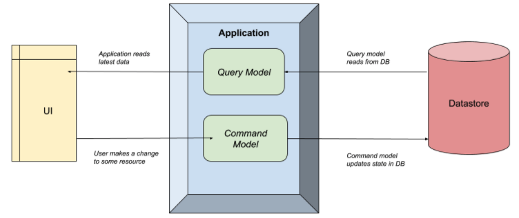
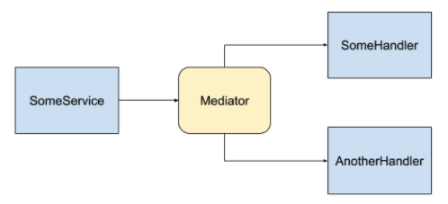
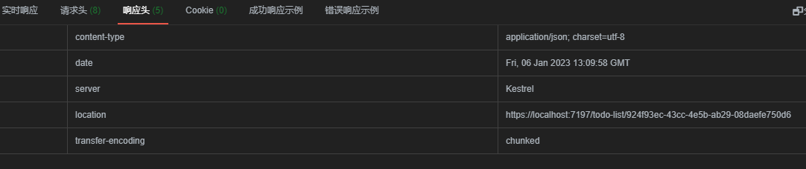
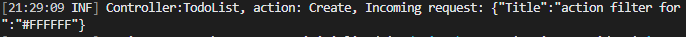
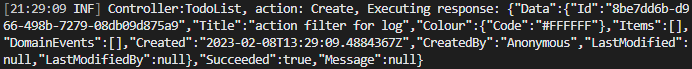

# .NET6项目实战

个人学习用的实战项目，内容大体是跟着如下博客做的，按照比较偏小白的方式一步一步构建起项目，这个项目对于初学者是不友好的，不过这依然是很值得学习的.Net项目。日复一日，必有精进。

> 作者：CODE4NOTHING
>
> 出处：https://www.cnblogs.com/code4nothing/p/build-todolist-index.html
>
> 版权：本作品采用「[署名-非商业性使用-相同方式共享 4.0 国际](https://creativecommons.org/licenses/by-nc-sa/4.0/)」许可协议进行许可。
>
> 欢迎转载，转载请注明出处

## 一.项目搭建项目

### TodoList需求简介

首先明确一下我们即将开发的这个TodoList应用都需要完成什么功能，我不会一次性把所有的特性诸如允许用户登陆之类的需求全部写上，只是先列出最基本的功能性需求：

1. 我们可以维护一个TodoList。
2. TodoList可以包含多个TodoItem。
3. 对于TodoList，我们可以设置其名称
4. 对于每个TodoItem，我们可以设置其内容，超期时间，是否完成。
5. 对于所有实体，可以完成增删改查的操作。

### 搭建解决方案结构

```powershell
# 创建解决方案目录 此后项目路径都在这里
mkdir TodoList && cd TodoList

# 创建解决方案
dotnet new sln -n TodoList

# 按照clean architecture的项目结构，创建WebApi项目以及classlib项目
dotnet new webapi -f net6.0 -n TodoList.Api -o ./src/TodoList.Api
dotnet new classlib -f net6.0 -n TodoList.Application -o ./src/TodoList.Application
dotnet new classlib -f net6.0 -n TodoList.Domain -o ./src/TodoList.Domain
dotnet new classlib -f net6.0 -n TodoList.Infrastructure -o ./src/TodoList.Infrastructure

# 按照clean architecture的结构和依赖关系，设置项目间的引用
# Application只依赖于Domain
dotnet add src/TodoList.Application/TodoList.Application.csproj reference src/TodoList.Domain/TodoList.Domain.csproj
# Infrastructure只依赖于Application
dotnet add src/TodoList.Infrastructure/TodoList.Infrastructure.csproj reference src/TodoList.Application/TodoList.Application.csproj
# Api依赖于Application和Infrastructure
dotnet add src/TodoList.Api/TodoList.Api.csproj reference src/TodoList.Application/TodoList.Application.csproj
dotnet add src/TodoList.Api/TodoList.Api.csproj reference src/TodoList.Infrastructure/TodoList.Infrastructure.csproj

# 将所有项目添加到sln上
dotnet sln TodoList.sln add src/TodoList.Api/TodoList.Api.csproj
dotnet sln TodoList.sln add src/TodoList.Application/TodoList.Application.csproj
dotnet sln TodoList.sln add src/TodoList.Domain/TodoList.Domain.csproj
dotnet sln TodoList.sln add src/TodoList.Infrastructure/TodoList.Infrastructure.csproj
```

### 项目运行

```powershell
dotnet restore

dotnet run --project src/TodoList.Api/TodoList.Api.csproj 
```

## 二.引入日志库

本项目使用Serilog来进行日志记录

### 原理和思路

1. 为项目引入`Serilog.AspNetCore`包

   ```powershell
   cd .\src\TodoList.Infrastructure\
   dotnet add package Serilog.AspNetCore
   cd ../..
   ```

2. 为`Serilog`的`Logger`提供配置，可以通过代码的方式进行配置，也可以通过.json文件来读取配置

3. 在程序启动构造`WebApplicationBuilder`对象的时候声明`UseSerilog();`

2. 在需要使用日志的地方注入`ILogger<T>`对象即可

### 配置实现

在`TodoList.Infrastructure`项目中新增一个文件夹，取名`Log`，在其中新建文件`ConfigureLogProvider.cs`

```powershell
mkdir .\src\TodoList.Infrastructure\Log
New-Item .\src\TodoList.Infrastructure\Log\ConfigureLogProvider.cs
```


使用一个`ConfigureLogProvider`来为`WebApplicationBuilder`添加扩展方法，用以配置日志，如下：

```c#
using Microsoft.AspNetCore.Builder;
using Microsoft.Extensions.Configuration;
using Serilog;

namespace TodoList.Infrastructure.Log;

public static class ConfigureLogProvider
{
    public static void ConfigureLog(this WebApplicationBuilder builder)
    {
        if (builder.Configuration.GetValue<bool>("UseFileToLog"))
        {
            // 配置同时输出到控制台和文件，并且指定文件名和文件转储方式（形如log-20211219.txt格式），转储文件保留的天数为15天，以及日志格式
            // 配置Enrich.FromLogContext()的目的是为了从日志上下文中获取一些关键信息诸如用户ID或请求ID，我们的应用中暂时不使用这些。
            Serilog.Log.Logger = new LoggerConfiguration()
                .Enrich.FromLogContext()
                .WriteTo.Console()
                .WriteTo.File(
                    "logs/log-.txt",
                    outputTemplate: "{Timestamp:yyyy-MM-dd HH:mm:ss.fff zzz} [{Level:u3}] {Message:lj}{NewLine}{Exception}",
                    rollingInterval: RollingInterval.Day,
                    retainedFileCountLimit: 15)
                .CreateLogger();
        }
        else
        {
            // 仅配置控制台日志
            Serilog.Log.Logger = new LoggerConfiguration()
                .Enrich.FromLogContext()
                .WriteTo.Console()
                .CreateLogger();
        }

        // 使用Serilog作为日志框架，注意这里和.NET 5及之前的版本写法是不太一样的。
        builder.Host.UseSerilog();
    }
}
```


在`var builder = WebApplication.CreateBuilder(args); `之后通过`builder`调用扩展方法`ConfigureLog();`来配置日志。

```c#
using TodoList.Infrastructure.Log;

var builder = WebApplication.CreateBuilder(args);

// Add services to the container.
// 配置日志
builder.ConfigureLog();

builder.Services.AddControllers();
// ... 省略以下
```


并可以向`appsettings.Development.json`文件中添加配置来决定是否向文件中写入日志。

```json
{
  "Logging": {
    "LogLevel": {
      "Default": "Information",
      "Microsoft.AspNetCore": "Warning"
    }
  },
  "UseFileToLog": true
}
```


最后在注入了`ILogger<WeatherForecastController>`的Controller中使用日志功能。

## 三.引入数据存储

### 原理与思路

1. 引入EFCore相关的nuget包并进行配置；
2. 添加DbContext对象并进行依赖注入；
3. 修改相关`appsettings.{environment}.json`文件；
4. 主程序配置。
5. 本地运行`MSSQL Server`容器并实现数据持久化；

### 实现

1. 通过以下命令引入Nuget包

   ```powershell
   cd .\src\TodoList.Infrastructure\
   
   dotnet add package Microsoft.EntityFrameworkCore.SqlServer
   
   # 第二个包是用于使用PowerShell命令（Add-Migration/Update-Database/...）需要的，如果使用eftool，可以不安装这个包。
   dotnet add package Microsoft.EntityFrameworkCore.Tools
   
   cd ../..
   
   # 为了使用eftool，需要在Api项目中引入以下Nuget包:
   cd .\src\TodoList.Api\
   
   dotnet add package Microsoft.EntityFrameworkCore.Design
   
   cd ../..
   ```

   

2. 添加DBContext对象并进行配置，在`Application`中新建一个`Common/Interfaces`文件夹用于存放应用程序定义的抽象接口`IApplicationDbContext`：

   ```powershell
   mkdir .\src\TodoList.Application\Common
   mkdir .\src\TodoList.Application\Common\Interfaces
   New-Item .\src\TodoList.Application\Common\Interfaces\IApplicationDbContext.cs
   ```

   

   ```c#
   namespace TodoList.Application.Common.Interfaces;
   
   public interface IApplicationDbContext
   {
       Task<int> SaveChangesAsync(CancellationToken cancellationToken);
   }
   ```

   

   在`Infrastructure`项目中新建`Persistence`文件夹用来存放和数据持久化相关的具体逻辑，我们在其中定义`DbContext`对象并实现刚才定义的接口。

   ```powershell
   mkdir .\src\TodoList.Infrastructure\Persistence
   New-Item .\src\TodoList.Infrastructure\Persistence\TodoListDbContext.cs
   ```

   

   ```c#
   using Microsoft.EntityFrameworkCore;
   using TodoList.Application.Common.Interfaces;
   
   namespace TodoList.Infrastructure.Persistence;
   
   public class TodoListDbContext : DbContext, IApplicationDbContext
   {
       public TodoListDbContext(DbContextOptions<TodoListDbContext> options) : base(options)
       {
       }
   }
   ```

   

   在`Infrastructure`项目中添加`DependencyInjection.cs`文件用于添加所有第三方的依赖：

   ```powershell
   New-Item .\src\TodoList.Infrastructure\DependencyInjection.cs
   ```

   

   ```C#
   using Microsoft.EntityFrameworkCore;
   using Microsoft.Extensions.Configuration;
   using Microsoft.Extensions.DependencyInjection;
   using TodoList.Application.Common.Interfaces;
   using TodoList.Infrastructure.Persistence;
   
   namespace TodoList.Infrastructure;
   
   public static class DependencyInjection
   {
       public static IServiceCollection AddInfrastructure(this IServiceCollection services, IConfiguration configuration)
       {
           services.AddDbContext<TodoListDbContext>(options =>
               options.UseSqlServer(
                   configuration.GetConnectionString("SqlServerConnection"),
                   b => b.MigrationsAssembly(typeof(TodoListDbContext).Assembly.FullName)));
   
           services.AddScoped<IApplicationDbContext>(provider => provider.GetRequiredService<TodoListDbContext>());
   
           return services;
       }
   }
   
   ```

   

3. 对`appsettings.Development.json`文件进行配置：

   ```json
   {
     "Logging": {
       "LogLevel": {
         "Default": "Information",
         "Microsoft.AspNetCore": "Warning"
       }
     },
     "UseFileToLog": true,
     "ConnectionStrings": {
       "SqlServerConnection": "Server=localhost;Database=TodoListDb;User Id=TodoListDBA;Password=TodoListDBA;"
     }
   }
   ```

   **本地sql server**

   在本地sql server创建TodoListDB数据库

   ```sql
   use master
   go
   
   if db_id ('TodoListDB')is not null--判断数据库，是否已存在
   begin
       drop database TodoListDB        --如果该数据库已经存在，那么就删除它
   end
   else
   begin
       create database TodoListDB
       on  primary        --表示属于 primary 文件组
       (
           name='TodoListDB_data',        -- 主数据文件的逻辑名称
           filename='<filePath>\TodoListDB_data.mdf',    -- 主数据文件的物理名称
           size=8mb,    --主数据文件的初始大小
           --maxsize=100mb,     -- 主数据文件增长的最大值
           filegrowth=15%        --主数据文件的增长率
       )
       log on
       (
           name='TodoListDB_log',        -- 日志文件的逻辑名称
           filename='<filePath>\TodoListDB_log.ldf',    -- 日志文件的物理名称
           size=8mb,            --日志文件的初始大小
           --maxsize=20mb,        --日志文件增长的最大值
           filegrowth=1mb        --日志文件的增长率
       )
   end
   ```

   创建用户来操作TodoListDB

   ```sql
   -- 创建账号
   IF ( NOT EXISTS ( SELECT    1
                     FROM      sys.sql_logins
                     WHERE     name = 'TodoListDBA' )
      )
       CREATE LOGIN TodoListDBA WITH PASSWORD='TodoListDBA', --default_database=TodoListDB
   GO
   -- 创建用户
   IF ( USER_ID('TodoListDBA') IS NOT NULL )
       DROP  USER TodoListDBA
   GO
   use TodoListDB
   create user TodoListDBA for login TodoListDBA with default_schema=dbo --dbo为DataBaseOwner的简写，每个数据库都有一个dbo用户
   exec sp_addrolemember 'db_owner', 'TodoListDBA'   --将TodoListDBA加入 db_owner角色
   ```

   **Docker容器**

   ```powershell
   # 拉取mssql镜像
   docker pull mcr.microsoft.com/mssql/server:2019-latest
   
   # 创建持久化存储
   docker create -v /var/opt/mssql --name mssqldata  mcr.microsoft.com/mssql/server:2019-latest /bin/true
   
   # 运行mssql容器，挂载持久化存储卷
   docker run -d --volumes-from mssqldata --name mssql -e 'ACCEPT_EULA=Y' -e 'SA_PASSWORD=StrongPwd123' -p 1433:1433 --restart-always mcr.microsoft.com/mssql/server:2019-latest
   
   docker start mssql
   
   # 确认容器运行状态
   docker ps
   ```

   ```sql
   begin
       create database [TodoListDB]
       on  primary        --表示属于 primary 文件组
       (
           name=N'TodoListDB',        -- 主数据文件的逻辑名称
           filename=N'/var/opt/mssql/data\TodoListDB.ndf',    -- 主数据文件的物理名称
           size=8mb,    --主数据文件的初始大小
           --maxsize=100mb,     -- 主数据文件增长的最大值
           filegrowth=15%        --主数据文件的增长率
       )
       log on
       (
           name=N'TodoListDB_log',        -- 日志文件的逻辑名称
           filename=N'/var/opt/mssql/data\TodoListDB_log.ldf',    -- 日志文件的物理名称
           size=8mb,            --日志文件的初始大小
           --maxsize=20mb,        --日志文件增长的最大值
           filegrowth=1mb        --日志文件的增长率
       )
   end
   ```

   ```sql
   -- 创建账号
   IF ( NOT EXISTS ( SELECT    1
                     FROM      sys.sql_logins
                     WHERE     name = 'TodoListDBA' )
      )
       CREATE LOGIN TodoListDBA WITH PASSWORD='TodoListDBA@123' --default_database=TodoListDB
   GO
   -- 创建用户
   IF ( USER_ID('TodoListDBA') IS NOT NULL )
       DROP  USER TodoListDBA
   GO
   use TodoListDB
   create user TodoListDBA for login TodoListDBA with default_schema=dbo --dbo为DataBaseOwner的简写，每个数据库都有一个dbo用户
   exec sp_addrolemember 'db_owner', 'TodoListDBA'   --将TodoListDBA加入 db_owner角色
   ```

4. 在Api项目中调用上面写好的扩展方法

   ```c#
   var builder = WebApplication.CreateBuilder(args);
   
   // Add services to the container.
   builder.ConfigureLog();
   
   builder.Services.AddControllers();
   builder.Services.AddEndpointsApiExplorer();
   builder.Services.AddSwaggerGen();
   
   // 添加EF数据库上下文配置
   builder.Services.AddInfrastructure(builder.Configuration);
   
   // 省略以下...
   ```

6. 安装ef工具并更新一条迁移数据

   ```bash
   dotnet tool install --global dotnet-ef
   # dotnet tool update --global dotnet-ef
   
   # 生成Migration
   dotnet ef migrations add SetupDb -p src/TodoList.Infrastructure/TodoList.Infrastructure.csproj -s src/TodoList.Api/TodoList.Api.csproj
   ```

   

7. 为了使程序在启动时时自动迁移实体结构，我们向`Infrastructure`项目中增加一个文件`ApplicationStartupExtensions.cs`并实现扩展方法：

   ```powershell
   New-Item .\src\TodoList.Infrastructure\ApplicationStartupExtensions.cs
   ```
   
   ```c#
   using Microsoft.AspNetCore.Builder;
   using Microsoft.EntityFrameworkCore;
   using Microsoft.Extensions.DependencyInjection;
   using TodoList.Infrastructure.Persistence;
   
   namespace TodoList.Infrastructure;
   
   public static class ApplicationStartupExtensions
   {
       public static void MigrateDatabase(this WebApplication app)
       {
           using var scope = app.Services.CreateScope();
           var services = scope.ServiceProvider;
   
           try
           {
               var context = services.GetRequiredService<TodoListDbContext>();
               context.Database.Migrate();
           }
           catch (Exception ex)
           {
               throw new Exception($"An error occurred migrating the DB: {ex.Message}");
           }
       }
   }
   ```
   
   在Api项目中调用扩展方法
   
   ```c#
   //Program.cs
   
   // 省略以上...
   app.MapControllers();
   
   // 调用扩展方法
   app.MigrateDatabase();
   
   app.Run();
   ```
   

## 四.领域实体创建

### 1.目标

- 定义领域实体；
- 通过数据库操作领域实体

### 2.原理和思路

首先比较明确的是，我们的实体对象应该有两个：`TodoList`和`TodoItem`，并且一个`TodoList`是由多个`TodoItem`的列表构成，除此以外在实际的开发中，我们可能还需要追踪实体的变更情况，比如需要知道创建时间/修改时间/创建者/修改者，这种需求一般作为审计要求出现，而对实体的审计又是一个比较通用的需求。所以我们会将实体分成两部分：和业务需求直接相关的属性，以及和实体审计需求相关的属性。

其次，对于实体的数据库配置，有两种方式：通过`Attribute`或者通过`IEntityTypeConfiguration<T>`以代码的方式进行。我推荐使用第二种方式，将所有的具体配置集中到`Infrastructure`层去管理，避免后续修改字段属性而去频繁修改位于`Domain`层的实体对象定义，我们希望实体定义本身是稳定的。

### 3.实现

#### 1.基础的领域概念框架搭建

所有和领域相关的概念都会进入到`Domain`这个项目中，我们首先在`Domain`项目里新建文件夹`Base`用于存放所有的基础定义，下面将一个一个去实现。

#### 2.基础实体定义以及可审计实体定义

我这两个类都应该是抽象基类，他们的存在是为了让我们的业务实体继承使用的，并且为了允许不同的实体可以定义自己主键的类型，我们将基类定义成泛型的。

- `AuditableEntity.cs`

```
mkdir .\src\TodoList.Domain\Base
New-Item .\src\TodoList.Domain\Base\AuditableEntity.cs
```

```c#
namespace TodoList.Domain.Base;

public abstract class AuditableEntity
{
    public DateTime Created { get; set; }
    public string? CreatedBy { get; set; }
    public DateTime? LastModified { get; set; }
    public string? LastModifiedBy { get; set; }
}
```

在`Base`里增加`Interfaces`文件夹来保存接口定义。

- `IEntity.cs`

```powershell
mkdir .\src\TodoList.Domain\Base\Interfaces
New-Item .\src\TodoList.Domain\Base\Interfaces\IEntity.cs
```

```c#
namespace TodoList.Domain.Base.Interfaces;

public interface IEntity<T>
{
    public T Id { get; set; }
}
```

除了这两个对象之外，我们还需要增加关于领域事件框架的定义。

- `DomainEvent.cs`

```powershell
New-Item .\src\TodoList.Domain\Base\DomainEvent.cs
```

```c#
namespace TodoList.Domain.Base;

public abstract class DomainEvent
{
    protected DomainEvent()
    {
        DateOccurred = DateTimeOffset.UtcNow;
    }
    public bool IsPublished { get; set; }
    public DateTimeOffset DateOccurred { get; protected set; } = DateTime.UtcNow;
}
```

- `IHasDomainEvent.cs`

```powershell
New-Item .\src\TodoList.Domain\Base\IHasDomainEvent.cs
```

```c#
namespace TodoList.Domain.Base.Interfaces;

public interface IHasDomainEvent
{
    public List<DomainEvent> DomainEvents { get; set; }
}
```

我们还剩下`Aggregate Root`, `ValueObject`和`Domain Service`以及`Domain Exception`，其他的相关概念暂时就不涉及了。

- `IAggregateRoot.cs`

```powershell
New-Item .\src\TodoList.Domain\Base\Interfaces\IAggregateRoot.cs
```

```c#
namespace TodoList.Domain.Base.Interfaces;

// 聚合根对象仅仅作为标记来使用
public interface IAggregateRoot { }
```

`ValueObject`的实现有几乎固定的写法

- `ValueObject.cs`

```powershell
New-Item .\src\TodoList.Domain\Base\ValueObject.cs
```

```c#
namespace TodoList.Domain.Base;

public abstract class ValueObject
{
    protected static bool EqualOperator(ValueObject left, ValueObject right)
    {
        if (left is null ^ right is null)
        {
            return false;
        }

        return left?.Equals(right!) != false;
    }

    protected static bool NotEqualOperator(ValueObject left, ValueObject right)
    {
        return !(EqualOperator(left, right));
    }

    protected abstract IEnumerable<object> GetEqualityComponents();

    public override bool Equals(object? obj)
    {
        if (obj == null || obj.GetType() != GetType())
        {
            return false;
        }

        var other = (ValueObject)obj;
        return GetEqualityComponents().SequenceEqual(other.GetEqualityComponents());
    }

    public override int GetHashCode()
    {
        return GetEqualityComponents()
            .Select(x => x != null ? x.GetHashCode() : 0)
            .Aggregate((x, y) => x ^ y);
    }
}
```

#### 3.定义TodoLIst/TodoItem实体

`TodoList`对象从领域建模上来说属于聚合根，并且下一节将要实现的`TodoItem`是构成该聚合根的一部分，业务意思上不能单独存在。有一种实现方式是按照聚合根的关联性进行代码组织：即在`Domain`项目里新建文件夹`AggregateRoots/TodoList`来保存和这个聚合根相关的所有业务定义：即：`Events`/`Exceptions`和`Enums`三个文件夹用于存放对应的内容。但是这样可能会导致项目的目录层级太多，实际上在这里，我更倾向于在`Domain`项目的根目录下创建`Entities`/`Events`/`Enums`/`Exceptions`/`ValueObjects`文件夹来扁平化领域模型，对于实际的开发查找起来也并不麻烦。所以才去后一种方式，然后在`Entities`中创建`TodoItem`和`TodoList`实体：

```powershell
mkdir .\src\TodoList.Domain\Entities
mkdir .\src\TodoList.Domain\Events
mkdir .\src\TodoList.Domain\Enums
mkdir .\src\TodoList.Domain\Exceptions
mkdir .\src\TodoList.Domain\ValueObjects
```

- `TodoItem.cs`

```powershell
New-Item .\src\TodoList.Domain\Entities\TodoItem.cs
```

```c#
using TodoList.Domain.Base;
using TodoList.Domain.Base.Interfaces;
using TodoList.Domain.Enums;
using TodoList.Domain.Events;

namespace TodoList.Domain.Entities;

public class TodoItem : AuditableEntity, IEntity<Guid>, IHasDomainEvent
{
    public Guid Id { get; set; }
    public Guid ListId { get; set; }
    public string? Title { get; set; }
    public PriorityLevel Priority { get; set; }

    private bool _done;
    public bool Done
    {
        get => _done;
        set
        {
            if (value && _done == false)
            {
                DomainEvents.Add(new TodoItemCompletedEvent(this));
            }

            _done = value;
        }
    }

    public TodoList List { get; set; } = null!;

    public List<DomainEvent> DomainEvents { get; set; } = new List<DomainEvent>();
}
```

- `PriorityLevel.cs`

```powershell
New-Item .\src\TodoList.Domain\Enums\PriorityLevel.cs
```

```c#
namespace TodoList.Domain.Enums;

public enum PriorityLevel
{
    None = 0,
    Low = 1,
    Medium = 2,
    High = 3
}
```

- `TodoItemCompletedEvent.cs`

```powershell
New-Item .\src\TodoList.Domain\Events\TodoItemCompletedEvent.cs
```

```c#
using TodoList.Domain.Base;
using TodoList.Domain.Entities;

namespace TodoList.Domain.Events;

public class TodoItemCompletedEvent : DomainEvent
{
    public TodoItemCompletedEvent(TodoItem item) => Item = item;

    public TodoItem Item { get; }
}
```

- `TodoList.cs`

```powershell
New-Item .\src\TodoList.Domain\Entities\TodoList.cs
```

```c#
using TodoList.Domain.Base;
using TodoList.Domain.Base.Interfaces;
using TodoList.Domain.ValueObjects;

namespace TodoList.Domain.Entities;

public class TodoList : AuditableEntity, IEntity<Guid>, IHasDomainEvent, IAggregateRoot
{
    public Guid Id { get; set; }
    public string? Title { get; set; }
    public Colour Colour { get; set; } = Colour.White;

    public IList<TodoItem> Items { get; private set; } = new List<TodoItem>();
    public List<DomainEvent> DomainEvents { get; set; } = new List<DomainEvent>();
}
```

为了演示`ValueObject`，添加了一个`Colour`对象，同时添加了一个领域异常对象`UnsupportedColourException`

- `Colour.cs`

```powershell
New-Item .\src\TodoList.Domain\ValueObjects\Colour.cs
```

```c#
using TodoList.Domain.Base;
using TodoList.Domain.Exceptions;

namespace TodoList.Domain.ValueObjects;

public class Colour : ValueObject
{
    static Colour() { }
    private Colour() { }
    private Colour(string code) => Code = code;

    public static Colour From(string code)
    {
        var colour = new Colour { Code = code };

        if (!SupportedColours.Contains(colour))
        {
            throw new UnsupportedColourException(code);
        }

        return colour;
    }

    public static Colour White => new("#FFFFFF");
    public static Colour Red => new("#FF5733");
    public static Colour Orange => new("#FFC300");
    public static Colour Yellow => new("#FFFF66");
    public static Colour Green => new("#CCFF99 ");
    public static Colour Blue => new("#6666FF");
    public static Colour Purple => new("#9966CC");
    public static Colour Grey => new("#999999");

    public string Code { get; private set; } = "#000000";

    public static implicit operator string(Colour colour) => colour.ToString();
    public static explicit operator Colour(string code) => From(code);

    public override string ToString() => Code;

    protected static IEnumerable<Colour> SupportedColours
    {
        get
        {
            yield return White;
            yield return Red;
            yield return Orange;
            yield return Yellow;
            yield return Green;
            yield return Blue;
            yield return Purple;
            yield return Grey;
        }
    }

    protected override IEnumerable<object> GetEqualityComponents()
    {
        yield return Code;
    }
}

```

- `UnsupportedColourException.cs`

```powershell
New-Item .\src\TodoList.Domain\Exceptions\UnsupportedColourException.cs
```

```c#
namespace TodoList.Domain.Exceptions;

public class UnsupportedColourException : Exception
{
    public UnsupportedColourException(string code)
        : base($"Colour \"{code}\" is unsupported.")
    {
    }
}

```

#### 4.领域实体的数据库配置

我们在`Infrastructure/Persistence`中新建文件夹`Configurations`用于存放实体配置：

```powershell
mkdir .\src\TodoList.Infrastructure\Persistence\Configurations
```


- `TodoItemConfiguration.cs`

```powershell
New-Item .\src\TodoList.Infrastructure\Persistence\Configurations\TodoItemConfiguration.cs
```

```c#
using Microsoft.EntityFrameworkCore;
using Microsoft.EntityFrameworkCore.Metadata.Builders;
using TodoList.Domain.Entities;

namespace TodoList.Infrastructure.Persistence.Configurations;

public class TodoItemConfiguration : IEntityTypeConfiguration<TodoItem>
{
    public void Configure(EntityTypeBuilder<TodoItem> builder)
    {
        // 领域事件字段不用写入数据库
        builder.Ignore(e => e.DomainEvents);

        // 设置实体属性的检验规则
        builder.Property(t => t.Title)
            .HasMaxLength(200)
            .IsRequired();
    }
}
```

- `TodoListConfiguration.cs`

```powershell
New-Item .\src\TodoList.Infrastructure\Persistence\Configurations\TodoListConfiguration.cs
```

```c#
using Microsoft.EntityFrameworkCore;
using Microsoft.EntityFrameworkCore.Metadata.Builders;

namespace TodoList.Infrastructure.Persistence.Configurations;

public class TodoListConfiguration : IEntityTypeConfiguration<Domain.Entities.TodoList>
{
    public void Configure(EntityTypeBuilder<Domain.Entities.TodoList> builder)
    {
        // 忽略领域事件字段
        builder.Ignore(t => t.DomainEvents);

        // 设置实体属性的检验规则
        builder.Property(t => t.Title)
            .HasMaxLength(200)
            .IsRequired();

        // 设置实体类之间的所有关系
        builder.OwnsOne(b => b.Colour);
    }
}
```

#### 修改DbContext

在这一步里面，我们需要完成以下几件事：

1. 添加数据表;
2. 重写SaveChangesAsync方法，自动补充审计相关字段值，并且在此发送领域事件;

对于第一件事，很简单。向`TodoListDbContext.cs`类定义中加入：

```c#
// TodoLIst实体与命名空间名称有冲突，所以需要显示引用其命名空间里的对象
public DbSet<Domain.Entities.TodoList> TodoLists => Set<Domain.Entities.TodoList>();
public DbSet<TodoItem> TodoItems => Set<TodoItem>();
```

对于第二件事，我们需要先向`Application/Common/Interfaces`中添加一个接口用于管理领域事件的分发，但是在讲到`CQRS`之前，我们暂时以`Dummy`的方式实现这个接口，因为将要使用第三方框架实现具体逻辑，所以我们把实现类放到`Infrastrcucture/Services`目录下，并在`TodoListDbContext`中注入使用。

- `IDomainEventService.cs`

```powershell
New-Item .\src\TodoList.Application\Common\Interfaces\IDomainEventService.cs
```


```c#
using TodoList.Domain.Base;

namespace TodoList.Application.Common.Interfaces;

public interface IDomainEventService
{
    Task Publish(DomainEvent domainEvent);
}
```

- `DomainEventService.cs`

```powershell
mkdir .\src\TodoList.Infrastructure\Services
New-Item .\src\TodoList.Infrastructure\Services\DomainEventService.cs
```


```c#
using Microsoft.Extensions.Logging;
using TodoList.Application.Common.Interfaces;
using TodoList.Domain.Base;

namespace TodoList.Infrastructure.Services;

public class DomainEventService : IDomainEventService
{
    private readonly ILogger<DomainEventService> _logger;

    public DomainEventService(ILogger<DomainEventService> logger)
    {
        _logger = logger;
    }

    public async Task Publish(DomainEvent domainEvent)
    {
        // 在这里暂时什么都不做，到CQRS那一篇的时候再回来补充这里的逻辑
        _logger.LogInformation("Publishing domain event. Event - {event}", domainEvent.GetType().Name);
    }
}

```

在`DependencyInjection`中注入：

```c#
// 省略以上...并且这一句可以不需要了
// services.AddScoped<IApplicationDbContext>(provider => provider.GetRequiredService<TodoListDbContext>());

// 增加依赖注入
services.AddScoped<IDomainEventService, DomainEventService>();
return services;
```

最终的`TodoListDbContext`实现如下：

- `TodoListDbContext.cs`

```c#
using System.Reflection;
using Microsoft.EntityFrameworkCore;
using TodoList.Application.Common.Interfaces;
using TodoList.Domain.Base;
using TodoList.Domain.Base.Interfaces;
using TodoList.Domain.Entities;

namespace TodoList.Infrastructure.Persistence;
public class TodoListDbContext : DbContext
{
    private readonly IDomainEventService _domainEventService;

    public TodoListDbContext(
        DbContextOptions<TodoListDbContext> options,
        IDomainEventService domainEventService) : base(options)
    {
        _domainEventService = domainEventService;
    }

    public DbSet<Domain.Entities.TodoList> TodoLists => Set<Domain.Entities.TodoList>();
    public DbSet<TodoItem> TodoItems => Set<TodoItem>();

    public override async Task<int> SaveChangesAsync(CancellationToken cancellationToken = new())
    {
        // 在我们重写的SaveChangesAsync方法中，去设置审计相关的字段，目前对于修改人这个字段暂时先给个定值，等到后面讲到认证鉴权的时候再回过头来看这里
        foreach (var entry in ChangeTracker.Entries<AuditableEntity>())
        {
            switch (entry.State)
            {
                case EntityState.Added:
                    entry.Entity.CreatedBy = "Anonymous";
                    entry.Entity.Created = DateTime.UtcNow;
                    break;

                case EntityState.Modified:
                    entry.Entity.LastModifiedBy = "Anonymous";
                    entry.Entity.LastModified = DateTime.UtcNow;
                    break;
            }
        }

        // 在写数据库的时候同时发送领域事件，这里要注意一定要保证写入数据库成功后再发送领域事件，否则会导致领域对象状态的不一致问题。
        var events = ChangeTracker.Entries<IHasDomainEvent>()
                .Select(x => x.Entity.DomainEvents)
                .SelectMany(x => x)
                .Where(domainEvent => !domainEvent.IsPublished)
                .ToArray();

        var result = await base.SaveChangesAsync(cancellationToken);

        await DispatchEvents(events);

        return result;
    }

    protected override void OnModelCreating(ModelBuilder builder)
    {
        // 应用当前Assembly中定义的所有的Configurations，就不需要一个一个去写了。
        builder.ApplyConfigurationsFromAssembly(Assembly.GetExecutingAssembly());

        base.OnModelCreating(builder);
    }

    private async Task DispatchEvents(DomainEvent[] events)
    {
        foreach (var @event in events)
        {
            @event.IsPublished = true;
            await _domainEventService.Publish(@event);
        }
    }
}

```

### 4.验证

#### 生成Migrations

```powershell
dotnet ef migrations add AddEntities -p src/TodoList.Infrastructure/TodoList.Infrastructure.csproj -s src/TodoList.Api/TodoList.Api.csproj
```

#### 使用种子数据更新数据库

为了演示效果，在`Infrastructure/Persistence/`下创建`TodoListDbContextSeed.cs`文件并初始化种子数据：

- `TodoListDbContextSeed.cs`

```powershell
New-Item .\src\TodoList.Infrastructure\Persistence\TodoListDbContextSeed.cs
```


```c#
using Microsoft.EntityFrameworkCore;
using TodoList.Domain.Entities;
using TodoList.Domain.Enums;
using TodoList.Domain.ValueObjects;

namespace TodoList.Infrastructure.Persistence;

public static class TodoListDbContextSeed
{
    public static async Task SeedSampleDataAsync(TodoListDbContext context)
    {
        if (!context.TodoLists.Any())
        {
            var list = new Domain.Entities.TodoList
            {
                Title = "Shopping",
                Colour = Colour.Blue
            };
            list.Items.Add(new TodoItem { Title = "Apples", Done = true, Priority = PriorityLevel.High});
            list.Items.Add(new TodoItem { Title = "Milk", Done = true });
            list.Items.Add(new TodoItem { Title = "Bread", Done = true });
            list.Items.Add(new TodoItem { Title = "Toilet paper" });
            list.Items.Add(new TodoItem { Title = "Pasta" });
            list.Items.Add(new TodoItem { Title = "Tissues" });
            list.Items.Add(new TodoItem { Title = "Tuna" });
            list.Items.Add(new TodoItem { Title = "Water" });

            context.TodoLists.Add(list);

            await context.SaveChangesAsync();
        }
    }

    public static async Task UpdateSampleDataAsync(TodoListDbContext context)
    {
        var sampleTodoList = await context.TodoLists.FirstOrDefaultAsync();
        if (sampleTodoList == null)
        {
            return;
        }

        sampleTodoList.Title = "Shopping - modified";

        // 演示更新时审计字段的变化
        context.Update(sampleTodoList);
        await context.SaveChangesAsync();
    }
}

```

在应用程序初始化的扩展中进行初始化和更新：

- `ApplicationStartupExtensions.cs`

```c#
// 省略以上...
try
{
    var context = services.GetRequiredService<TodoListDbContext>();
    context.Database.Migrate();
    // 生成种子数据
    TodoListDbContextSeed.SeedSampleDataAsync(context).Wait();
    // 更新部分种子数据以便查看审计字段
    TodoListDbContextSeed.UpdateSampleDataAsync(context).Wait();
}
catch (Exception ex)
// 省略以下...

```

## 五.实现Repository模式

### 需求

如何实现一个可重用的`Repository`模块。

### 目标

实现通用`Repository`模式并进行验证。

### 原理和思路

通用的基础在于抽象，抽象的粒度决定了通用的程度，但是同时也决定了使用上的复杂度。对于自己的项目而言，抽象到什么程度最合适，需要自己去权衡，也许后面某个时候我会决定自己去实现一个完善的`Repository`库提供出来（事实上已经有很多人这样做了，我们甚至可以直接下载Nuget包进行使用，但是自己亲手去实现的过程能让你更好地去理解其中的原理，也理解如何开发一个通用的类库。）

总体思路是：在`Application`中定义相关的接口，在`Infrastructure`中实现基类的功能。

### 通用Repository实现

对于要如何去设计一个通用的`Repository`库，实际上涉及的面非常多，尤其是在获取数据的时候。而且根据每个人的习惯，实现起来的方式是有比较大的差别的，尤其是关于泛型接口到底需要提供哪些方法，每个人都有自己的理解，这里我只演示基本的思路，而且尽量保持简单，关于更复杂和更全面的实现，GIthub上有很多已经写好的库可以去学习和参考，我会列在下面：

很显然，第一步要去做的是在`Application/Common/Interfaces`中增加一个`IRepository<T>`的定义用于适用不同类型的实体，然后在`Infrastructure/Persistence/Repositories`中创建一个基类`RepositoryBase<T>`实现这个接口，并有办法能提供一致的对外方法签名。

- `IRepository.cs`

```powershell
New-Item .\src\TodoList.Application\Common\Interfaces\IRepository.cs
```


```c#
namespace TodoList.Application.Common.Interfaces;

public interface IRepository<T> where T : class
{
}
```

- `RepositoryBase.cs`

```powershell
mkdir .\src\TodoList.Infrastructure\Persistence\Repositories
New-Item .\src\TodoList.Infrastructure\Persistence\Repositories\RepositoryBase.cs
```


```c#
using Microsoft.EntityFrameworkCore;
using TodoList.Application.Common.Interfaces;

namespace TodoList.Infrastructure.Persistence.Repositories;

public class RepositoryBase<T> : IRepository<T> where T : class
{
    private readonly TodoListDbContext _dbContext;

    public RepositoryBase(TodoListDbContext dbContext) => _dbContext = dbContext;
}
```

在动手实际定义`IRepository<T>`之前，先思考一下：对数据库的操作都会出现哪些情况：

#### 新增实体（Create）

新增实体在`Repository`层面的逻辑很简单，传入一个实体对象，然后保存到数据库就可以了，没有其他特殊的需求。

- `IRepository.cs`

```c#
// 省略其他...
// Create相关操作接口
Task<T> AddAsync(T entity, CancellationToken cancellationToken = default);
```

- `RepositoryBase.cs`

```c#
// 省略其他...
public async Task<T> AddAsync(T entity, CancellationToken cancellationToken = default)
{
    await _dbContext.Set<T>().AddAsync(entity, cancellationToken);
    await _dbContext.SaveChangesAsync(cancellationToken);

    return entity;
}
```

#### 更新实体（Update）

和新增实体类似，但是更新时一般是单个实体对象去操作。

- `IRepository.cs`

```c#
// 省略其他...
// Update相关操作接口
Task UpdateAsync(T entity, CancellationToken cancellationToken = default);
```

- `RepositoryBase.cs`

```c#
// 省略其他...
public async Task UpdateAsync(T entity, CancellationToken cancellationToken = default)
{
    // 对于一般的更新而言，都是Attach到实体上的，只需要设置该实体的State为Modified就可以了
    _dbContext.Entry(entity).State = EntityState.Modified;
    await _dbContext.SaveChangesAsync(cancellationToken);
}
```

#### 删除实体（Delete）

- `IRepository.cs`

```c#
// 省略其他...
// Delete相关操作接口，这里根据key删除对象的接口需要用到一个获取对象的方法
ValueTask<T?> GetAsync(object key);
Task DeleteAsync(object key);
Task DeleteAsync(T entity, CancellationToken cancellationToken = default);
Task DeleteRangeAsync(IEnumerable<T> entities, CancellationToken cancellationToken = default);
```

- `RepositoryBase.cs`

```c#
// 省略其他...
public virtual ValueTask<T?> GetAsync(object key) => _dbContext.Set<T>().FindAsync(key);

public async Task DeleteAsync(object key)
{
    var entity = await GetAsync(key);
    if (entity is not null)
    {
        await DeleteAsync(entity);
    }
}

public async Task DeleteAsync(T entity, CancellationToken cancellationToken = default)
{
    _dbContext.Set<T>().Remove(entity);
    await _dbContext.SaveChangesAsync(cancellationToken);
}

public async Task DeleteRangeAsync(IEnumerable<T> entities, CancellationToken cancellationToken = default)
{
    _dbContext.Set<T>().RemoveRange(entities);
    await _dbContext.SaveChangesAsync(cancellationToken);
}
```

#### 获取实体（Retrieve）

对于如何获取实体，是最复杂的一部分。我们不仅要考虑通过什么方式获取哪些数据，还需要考虑获取的数据有没有特殊的要求比如排序、分页、数据对象类型的转换之类的问题。

具体来说，比如下面这一个典型的`LINQ`查询语句：

```c#
var results = await _context.A.Join(_context.B, a => a.Id, b => b.aId, (a, b) => new
    {
        // ...
    })
    .Where(ab => ab.Name == "name" && ab.Date == DateTime.Now)
    .Select(ab => new
    {
        // ...
    })
    .OrderBy(o => o.Date)
    .Skip(20 * 1)
    .Take(20)
    .ToListAsync();
```

可以将整个查询结构分割成以下几个组成部分，而且每个部分基本都是以lambda表达式的方式表示的，这转化成建模的话，可以使用`Expression`相关的对象来表示：

1. **查询数据集准备过程**，在这个过程中可能会出现`Include`/`Join`/`GroupJoin`/`GroupBy`等等类似的关键字，它们的作用是构建一个用于接下来将要进行查询的数据集。
2. **`Where`子句**，用于过滤查询集合。
3. **`Select`子句**，用于转换原始数据类型到我们想要的结果类型。
4. **`Order`子句**，用于对结果集进行排序，这里可能会包含类似：`OrderBy/OrderByDescending/ThenBy/ThenByDescending`等关键字。
5. **`Paging`子句**，用于对结果集进行后端分页返回，一般都是`Skip/Take`一起使用。
6. **其他子句**，多数是条件控制，比如`AsNoTracking`/`SplitQuery`等等。

为了保持我们的演示不会过于复杂，我会做一些取舍。在这里的实现我参考了[Edi.Wang](https://edi.wang/)的[Moonglade](https://github.com/EdiWang/Moonglade)中的相关实现。有兴趣的小伙伴也可以去找一下一个更完整的实现：[Ardalis.Specification](https://github.com/ardalis/Specification)。

首先来定义一个简单的`ISpecification`来表示查询的各类条件：

```powershell
New-Item .\src\TodoList.Application\Common\Interfaces\ISpecification.cs
cd .\src\TodoList.Application
dotnet add package Microsoft.EntityFrameworkCore
cd ../..
```


```c#
using System.Linq.Expressions;
using Microsoft.EntityFrameworkCore.Query;

namespace TodoList.Application.Common.Interfaces;

public interface ISpecification<T>
{
    // 查询条件子句
    Expression<Func<T, bool>>? Criteria { get; }
    // Include子句
    Func<IQueryable<T>, IIncludableQueryable<T, object>>? Include { get; }
    // OrderBy子句
    Expression<Func<T, object>>? OrderBy { get; }
    // OrderByDescending子句
    Expression<Func<T, object>>? OrderByDescending { get; }

    // 分页相关属性
    int Take { get; }
    int Skip { get; }
    bool IsPagingEnabled { get; }
}   
```

并实现这个泛型接口，放在`Application/Common`中：

```powershell
New-Item .\src\TodoList.Application\Common\SpecificationBase.cs
```


```c#
using System.Linq.Expressions;
using Microsoft.EntityFrameworkCore.Query;
using TodoList.Application.Common.Interfaces;

namespace TodoList.Application.Common;

public abstract class SpecificationBase<T> : ISpecification<T>
{
    protected SpecificationBase() { }
    protected SpecificationBase(Expression<Func<T, bool>> criteria) => Criteria = criteria;

    public Expression<Func<T, bool>>? Criteria { get; private set; }
    public Func<IQueryable<T>, IIncludableQueryable<T, object>>? Include { get; private set; }
    public List<string>? IncludeStrings { get; } = new();
    public Expression<Func<T, object>>? OrderBy { get; private set; }
    public Expression<Func<T, object>>? OrderByDescending { get; private set; }

    public int Take { get; private set; }
    public int Skip { get; private set; }
    public bool IsPagingEnabled { get; private set; }

    public void AddCriteria(Expression<Func<T, bool>> criteria) => Criteria = Criteria is not null ? Criteria.AndAlso(criteria) : criteria;

    protected virtual void AddInclude(Func<IQueryable<T>, IIncludableQueryable<T, object>> includeExpression) => Include = includeExpression;
    protected virtual void AddInclude(string includeString) => IncludeStrings?.Add(includeString);

    protected virtual void ApplyPaging(int skip, int take)
    {
        Skip = skip;
        Take = take;
        IsPagingEnabled = true;
    }

    protected virtual void ApplyOrderBy(Expression<Func<T, object>> orderByExpression) => OrderBy = orderByExpression;
    protected virtual void ApplyOrderByDescending(Expression<Func<T, object>> orderByDescendingExpression) => OrderByDescending = orderByDescendingExpression;
}

// https://stackoverflow.com/questions/457316/combining-two-expressions-expressionfunct-bool
public static class ExpressionExtensions
{
    public static Expression<Func<T, bool>> AndAlso<T>(this Expression<Func<T, bool>> expr1, Expression<Func<T, bool>> expr2)
    {
        var parameter = Expression.Parameter(typeof(T));

        var leftVisitor = new ReplaceExpressionVisitor(expr1.Parameters[0], parameter);
        var left = leftVisitor.Visit(expr1.Body);

        var rightVisitor = new ReplaceExpressionVisitor(expr2.Parameters[0], parameter);
        var right = rightVisitor.Visit(expr2.Body);

        return Expression.Lambda<Func<T, bool>>(
            Expression.AndAlso(left ?? throw new InvalidOperationException(),
                right ?? throw new InvalidOperationException()), parameter);
    }

    private class ReplaceExpressionVisitor : ExpressionVisitor
    {
        private readonly Expression _oldValue;
        private readonly Expression _newValue;

        public ReplaceExpressionVisitor(Expression oldValue, Expression newValue)
        {
            _oldValue = oldValue;
            _newValue = newValue;
        }

        public override Expression? Visit(Expression? node) => node == _oldValue ? _newValue : base.Visit(node);
    }
}
```

为了在`RepositoryBase`中能够把所有的Spcification串起来形成查询子句，我们还需要定义一个用于组织Specification的`SpecificationEvaluator`类：

```powershell
New-Item .\src\TodoList.Application\Common\SpecificationEvaluator.cs
```


```c#
using TodoList.Application.Common.Interfaces;

namespace TodoList.Application.Common;

public class SpecificationEvaluator<T> where T : class
{
    public static IQueryable<T> GetQuery(IQueryable<T> inputQuery, ISpecification<T>? specification)
    {
        var query = inputQuery;

        if (specification?.Criteria is not null)
        {
            query = query.Where(specification.Criteria);
        }

        if (specification?.Include is not null)
        {
            query = specification.Include(query);
        }

        if (specification?.OrderBy is not null)
        {
            query = query.OrderBy(specification.OrderBy);
        }
        else if (specification?.OrderByDescending is not null)
        {
            query = query.OrderByDescending(specification.OrderByDescending);
        }

        if (specification?.IsPagingEnabled != false)
        {
            query = query.Skip(specification!.Skip).Take(specification.Take);
        }

        return query;
    }
}
```

在`IRepository`中添加查询相关的接口，大致可以分为以下这几类接口，每类中又可能存在同步接口和异步接口：

- `IRepository.cs`

```c#
// 省略其他...
// 1. 查询基础操作接口
IQueryable<T> GetAsQueryable();
IQueryable<T> GetAsQueryable(ISpecification<T> spec);

// 2. 查询数量相关接口
int Count(ISpecification<T>? spec = null);
int Count(Expression<Func<T, bool>> condition);
Task<int> CountAsync(ISpecification<T>? spec);

// 3. 查询存在性相关接口
bool Any(ISpecification<T>? spec);
bool Any(Expression<Func<T, bool>>? condition = null);

// 4. 根据条件获取原始实体类型数据相关接口
Task<T?> GetAsync(Expression<Func<T, bool>> condition);
Task<IReadOnlyList<T>> GetAsync();
Task<IReadOnlyList<T>> GetAsync(ISpecification<T>? spec);

// 5. 根据条件获取映射实体类型数据相关接口，涉及到Group相关操作也在其中，使用selector来传入映射的表达式
TResult? SelectFirstOrDefault<TResult>(ISpecification<T>? spec, Expression<Func<T, TResult>> selector);
Task<TResult?> SelectFirstOrDefaultAsync<TResult>(ISpecification<T>? spec, Expression<Func<T, TResult>> selector);

Task<IReadOnlyList<TResult>> SelectAsync<TResult>(Expression<Func<T, TResult>> selector);
Task<IReadOnlyList<TResult>> SelectAsync<TResult>(ISpecification<T>? spec, Expression<Func<T, TResult>> selector);
Task<IReadOnlyList<TResult>> SelectAsync<TGroup, TResult>(Expression<Func<T, TGroup>> groupExpression, Expression<Func<IGrouping<TGroup, T>, TResult>> selector, ISpecification<T>? spec = null);
```

有了这些基础，我们就可以去`Infrastructure/Persistence/Repositories`中实现`RepositoryBase`类剩下的关于查询部分的代码了：

- `RepositoryBase.cs`

```c#
// 省略其他...
// 1. 查询基础操作接口实现
public IQueryable<T> GetAsQueryable()
    => _dbContext.Set<T>();

public IQueryable<T> GetAsQueryable(ISpecification<T> spec)
    => ApplySpecification(spec);

// 2. 查询数量相关接口实现
public int Count(Expression<Func<T, bool>> condition)
    => _dbContext.Set<T>().Count(condition);

public int Count(ISpecification<T>? spec = null)
    => null != spec ? ApplySpecification(spec).Count() : _dbContext.Set<T>().Count();

public Task<int> CountAsync(ISpecification<T>? spec)
    => ApplySpecification(spec).CountAsync();

// 3. 查询存在性相关接口实现
public bool Any(ISpecification<T>? spec)
    => ApplySpecification(spec).Any();

public bool Any(Expression<Func<T, bool>>? condition = null)
    => null != condition ? _dbContext.Set<T>().Any(condition) : _dbContext.Set<T>().Any();

// 4. 根据条件获取原始实体类型数据相关接口实现
public async Task<T?> GetAsync(Expression<Func<T, bool>> condition)
    => await _dbContext.Set<T>().FirstOrDefaultAsync(condition);

public async Task<IReadOnlyList<T>> GetAsync()
    => await _dbContext.Set<T>().AsNoTracking().ToListAsync();

public async Task<IReadOnlyList<T>> GetAsync(ISpecification<T>? spec)
    => await ApplySpecification(spec).AsNoTracking().ToListAsync();

// 5. 根据条件获取映射实体类型数据相关接口实现
public TResult? SelectFirstOrDefault<TResult>(ISpecification<T>? spec, Expression<Func<T, TResult>> selector)
    => ApplySpecification(spec).AsNoTracking().Select(selector).FirstOrDefault();

public Task<TResult?> SelectFirstOrDefaultAsync<TResult>(ISpecification<T>? spec, Expression<Func<T, TResult>> selector)
    => ApplySpecification(spec).AsNoTracking().Select(selector).FirstOrDefaultAsync();

public async Task<IReadOnlyList<TResult>> SelectAsync<TResult>(Expression<Func<T, TResult>> selector)
    => await _dbContext.Set<T>().AsNoTracking().Select(selector).ToListAsync();

public async Task<IReadOnlyList<TResult>> SelectAsync<TResult>(ISpecification<T>? spec, Expression<Func<T, TResult>> selector)
    => await ApplySpecification(spec).AsNoTracking().Select(selector).ToListAsync();

public async Task<IReadOnlyList<TResult>> SelectAsync<TGroup, TResult>(
    Expression<Func<T, TGroup>> groupExpression,
    Expression<Func<IGrouping<TGroup, T>, TResult>> selector,
    ISpecification<T>? spec = null)
    => null != spec ?
        await ApplySpecification(spec).AsNoTracking().GroupBy(groupExpression).Select(selector).ToListAsync() :
        await _dbContext.Set<T>().AsNoTracking().GroupBy(groupExpression).Select(selector).ToListAsync();

// 用于拼接所有Specification的辅助方法，接收一个`IQuerybale<T>对象（通常是数据集合）
// 和一个当前实体定义的Specification对象，并返回一个`IQueryable<T>`对象为子句执行后的结果。
private IQueryable<T> ApplySpecification(ISpecification<T>? spec)
    => SpecificationEvaluator<T>.GetQuery(_dbContext.Set<T>().AsQueryable(), spec);
```

### 引入使用

为了验证通用Repsitory的用法，我们可以先在`Infrastructure/DependencyInjection.cs`中进行依赖注入：

```c#
// in AddInfrastructure, 省略其他
services.AddScoped(typeof(IRepository<>), typeof(RepositoryBase<>));
```

### 验证

用于初步验证（主要是查询接口），我们在`Application`项目里新建文件夹`TodoItems/Specs`，创建一个`TodoItemSpec`类：

- `TodoItemSpec.cs`

```
mkdir .\src\TodoList.Application\TodoItems
mkdir .\src\TodoList.Application\TodoItems\Specs
New-Item .\src\TodoList.Application\TodoItems\Specs\TodoItemSpec.cs
```


```c#
using TodoList.Application.Common;
using TodoList.Domain.Entities;
using TodoList.Domain.Enums;

namespace TodoList.Application.TodoItems.Specs;

public sealed class TodoItemSpec : SpecificationBase<TodoItem>
{
    public TodoItemSpec(bool done, PriorityLevel priority) : base(t => t.Done == done && t.Priority == priority)
    {
    }
}
```

然后我们临时使用示例接口`WeatherForecastController`，通过日志来看一下查询的正确性。

```c#
private readonly IRepository<TodoItem> _repository;
private readonly ILogger<WeatherForecastController> _logger;

// 为了验证，临时在这注入IRepository<TodoItem>对象，验证完后撤销修改
public WeatherForecastController(IRepository<TodoItem> repository, ILogger<WeatherForecastController> logger)
{
    _repository = repository;
    _logger = logger;
}
```

在`Get`方法里增加这段逻辑用于观察日志输出：

```c#
// 记录日志
_logger.LogInformation($"maybe this log is provided by Serilog...");

var spec = new TodoItemSpec(true, PriorityLevel.High);
var items = _repository.GetAsync(spec).Result;

foreach (var item in items)
{
    _logger.LogInformation($"item: {item.Id} - {item.Title} - {item.Priority}");
}
```

启动`Api`项目然后请求示例接口，观察控制台输出

```powershell
dotnet run --project .\src\TodoList.Api\TodoList.Api.csproj

## https://localhost:<port>/swagger/index.html
```

## 六.使用MediatR实现POST请求

### 需求

需求很简单：如何创建新的`TodoList`和`TodoItem`并持久化。

初学者按照教程去实现的话，应该分成以下几步：创建`Controller`并实现`POST`方法；实用传入的请求参数`new`一个数据库实体对象；调用`IRepository<T>`完成数据库的写入，最多会在中间加一层`Service`。这个做法本身没有问题，也是需要从初学阶段开始扎实地掌握开发技能的必经之路，有助于帮助理解逻辑调用的过程。

对于稍微正式一些的项目，.NET工程上习惯的实现是通过使用一些比较成熟的类库框架，有效地对业务逻辑进行分类管理、消除冗余代码，以达到业务逻辑职责清晰简洁的目的。在这个阶段我们经常使用的两个类库分别是[AutoMapper](https://automapper.org/)和[MediatR](https://github.com/jbogard/MediatR)，本文结合`POST`请求，先介绍关于`MediatR`部分，下一篇关于`GET`请求，会涉及`AutoMapper`的部分。

### 目标

合理组织并使用[MediatR](https://github.com/jbogard/MediatR)，完成`POST`请求。

### 原理与思路

首先来简单地介绍一下这个类库。

#### 关于CQRS模式、中介者模式和MediatR

##### CQRS模式

CQRS模式全称是“Command Query Responsibility Segregation”，正如字面意思，CQRS模式的目的在于将读取操作和写入操作的指责区分开，并使用不同的Model去表示。从CRUD的角度来说，就是把`R`和`CUD`区分开来对待。如下图所示：



这个模式可以有效地应用到具有主从分离的数据库架构中，当需要获取数据时，从只读数据库（一般是从库）中读取数据，当需要写入或更新数据时，向主库进行操作。

CQRS模式旨在解决的问题是：为了屏蔽数据库层面“写优先”还是“读优先”的优化设计策略，在业务逻辑侧进行解耦。

任何设计模式都是对解决特定问题的一个Trade off，自然也带来了一些缺点，首先就是服务内部的组件复杂度上升了，因为需要创建额外的类来实现CQRS模式；其次如果数据层是分离的，那么可能会有数据的状态不一致问题。

##### 中介者[Mediator](https://refactoring.guru/design-patterns/mediator)模式

这是23种基本设计模式中的一个，属于行为型设计模式，它给出了组件之间交互的一种解耦的方式。简单参考下图，具体内容就不过多解释了，任何一篇介绍设计模式的文章都有介绍。



这种设计模式实际上是一种采用依赖倒置(Inversion of Control, IoC)的方式，实现了图中蓝色组件的松耦合。

##### MediatR

所有需要使用`MediatR`的地方都集中在`Application`项目中。

### 实现

所有需要使用`MediatR`的地方都集中在`Application`项目中。

#### 引入MediatR

```powershell
dotnet add .\src\TodoList.Application\TodoList.Application.csproj package MediatR.Extensions.Microsoft.DependencyInjection

dotnet add .\src\TodoList.Api\TodoList.Api.csproj package MediatR.Extensions.Microsoft.DependencyInjection
```

为了适配CQRS的模式，我们在`Application`项目中的`TodoLists`和`TodoItems`下相同地创建几个文件夹：

- `Commands`：用于组织`CUD`相关的业务逻辑；
- `Queries`：用于组织`R`相关的业务逻辑；
- `EventHandlers`：用于组织领域事件处理的相关业务逻辑。

在`Application`根目录下同样创建`DependencyInjection.cs`用于该项目的依赖注入：

- `DependencyInjection.cs`

```powershell
New-Item .\src\TodoList.Application\DependencyInjection.cs
```

```c#
using System.Reflection;
using MediatR;
using Microsoft.Extensions.DependencyInjection;

namespace TodoList.Application;

public static class DependencyInjection
{
    public static IServiceCollection AddApplication(this IServiceCollection services)
    {
        services.AddMediatR(Assembly.GetExecutingAssembly());
        return services;
    }
}
```

并在`Api`项目中使用：

```c#
// 省略其他...
// 添加应用层配置
builder.Services.AddApplication();
// 添加基础设施配置
builder.Services.AddInfrastructure(builder.Configuration);
```

#### 实现Post请求

在本章中我们只实现`TodoList`和`TodoItem`的`Create`接口（POST），剩下的接口后面的文章中逐步涉及。

##### POST TodoList

在`Application/TodoLists/Commands/`下新建一个目录`CreateTodoList`用于存放创建一个`TodoList`相关的所有逻辑：

- `CreateTodoListCommand.cs`

```powershell
New-Item .\src\TodoList.Application\TodoLists\Commands\CreateTodoListCommand.cs -Force
```

```c#
using MediatR;
using TodoList.Application.Common.Interfaces;

namespace TodoList.Application.TodoLists.Commands.CreateTodoList;

public class CreateTodoListCommand : IRequest<Guid>
{
    public string? Title { get; set; }
}

public class CreateTodoListCommandHandler : IRequestHandler<CreateTodoListCommand, Guid>
{
    private readonly IRepository<Domain.Entities.TodoList> _repository;

    public CreateTodoListCommandHandler(IRepository<Domain.Entities.TodoList> repository)
    {
        _repository = repository;
    }

    public async Task<Guid> Handle(CreateTodoListCommand request, CancellationToken cancellationToken)
    {
        var entity = new Domain.Entities.TodoList
        {
            Title = request.Title
        };

        await _repository.AddAsync(entity, cancellationToken);
        return entity.Id;
    }
}
```

有一些实践是将`Request`和`RequestHandler`分开两个文件，我更倾向于像这样将他俩放在一起，一是保持简洁，二是当你需要顺着一个Command去寻找它对应的Handler时，不需要更多的跳转。

接下来在TodoListController里实现对应的POST方法，

```powershell
New-Item .\src\TodoList.Api\Controllers\TodoListController.cs
```

```c#
using MediatR;
using Microsoft.AspNetCore.Mvc;
using TodoList.Application.TodoLists.Commands.CreateTodoList;

namespace TodoList.Api.Controllers;

[ApiController]
[Route("/todo-list")]
public class TodoListController : ControllerBase
{
    private readonly IMediator _mediator;

    // 注入MediatR
    public TodoListController(IMediator mediator)
        => _mediator = mediator;

    [HttpPost]
    public async Task<Guid> Create([FromBody] CreateTodoListCommand command)
    {
        var createdTodoList = await _mediator.Send(command);

        // 出于演示的目的，这里只返回创建出来的TodoList的Id，
        // 实际使用中可能会选择IActionResult作为返回的类型并返回CreatedAtRoute对象，
        // 因为我们还没有去写GET方法，返回CreatedAtRoute会报错（找不到对应的Route），等讲完GET后会在那里更新
        return createdTodoList;
    }
}
```

##### POST TodoItem

类似`TodoListController`和`CreateTodoListCommand`的实现，这里我直接把代码贴出来了。

- `CreateTodoItemCommand.cs`

```powershell
New-Item .\src\TodoList.Application\TodoItems\Commands\CreatTodoItem\CreateTodoItemCommand.cs -Force
```

```c#
using MediatR;
using TodoList.Application.Common.Interfaces;
using TodoList.Domain.Entities;
using TodoList.Domain.Events;

namespace TodoList.Application.TodoItems.Commands.CreateTodoItem;

public class CreateTodoItemCommand : IRequest<Guid>
{
    public Guid ListId { get; set; }

    public string? Title { get; set; }
}

public class CreateTodoItemCommandHandler : IRequestHandler<CreateTodoItemCommand, Guid>
{
    private readonly IRepository<TodoItem> _repository;

    public CreateTodoItemCommandHandler(IRepository<TodoItem> repository)
    {
        _repository = repository;
    }

    public async Task<Guid> Handle(CreateTodoItemCommand request, CancellationToken cancellationToken)
    {
        var entity = new TodoItem
        {
            // 这个ListId在前文中的代码里漏掉了，需要添加到Domain.Entities.TodoItem实体上
            ListId = request.ListId,
            Title = request.Title,
            Done = false
        };

        await _repository.AddAsync(entity, cancellationToken);

        return entity.Id;
    }
}
```

- `TodoItemController.cs`

```powershell
New-Item .\src\TodoList.Api\Controllers\TodoItemController.cs
```

```c#
using MediatR;
using Microsoft.AspNetCore.Mvc;
using TodoList.Application.TodoItems.Commands.CreateTodoItem;

namespace TodoList.Api.Controllers;

[ApiController]
[Route("/todo-item")]
public class TodoItemController : ControllerBase
{
    private readonly IMediator _mediator;

    // 注入MediatR
    public TodoItemController(IMediator mediator) 
        => _mediator = mediator;

    [HttpPost]
    public async Task<Guid> Create([FromBody] CreateTodoItemCommand command)
    {
        var createdTodoItem = await _mediator.Send(command);

        // 处于演示的目的，这里只返回创建出来的TodoItem的Id，理由同前
        return createdTodoItem;
    }
}
```

### 验证

```powershell
dotnet run --project .\src\TodoList.Api\TodoList.Api.csproj
## https://localhost:<port>/swagger/index.html
```


#### 创建TodoList验证

- 请求

```json
// Request body
{
  "title": "Test Create TodoList"
}
```

- 返回

```json
// Responses
// "7daab14e-177f-4bec-a64c-08daef9592d1"
```

- 数据库

#### 创建TodoItem验证

- 请求

```json
// Request body
{
  "listId": "7daab14e-177f-4bec-a64c-08daef9592d1",
  "title": "Test Create TodoItem1"
}
```

- 返回

```json
// Responses
// "b501c36d-2097-48dd-4672-08daef9627c8"
```

- 数据库

## 七.使用AutoMapper实现GET请求

### 需求

需求很简单：实现`GET`请求获取业务数据。在这个阶段我们经常使用的类库是[AutoMapper](https://automapper.org/)。

### 目标

合理组织并使用[AutoMapper](https://automapper.org/)，完成`GET`请求。

### 原理与思路

#### 关于AutoMapper

在业务侧代码和数据库实体打交道的过程中，一个必不可少的部分就是返回的数据类型转换。对于不同的请求来说，希望得到的返回值是数据库实体的一部分/组合/计算等情形。我们就经常需要手写用于数据对象转换的代码，但是转换前后可能大部分情况下有着相同名称的字段或属性。这部分工作能避免手写冗长的代码吗？可以。

我们希望接受的请求和返回的值（统一称为model）具有以下两点需要遵循的原则：

1. 每个model被且只被一个API消费；
2. 每个model里仅仅包含API发起方希望包含的必要字段或属性。

[AutoMapper](https://automapper.org/)库就是为了实现这个需求而存在的，它的具体用法请参考官方文档，尤其是关于`Convention`的部分，避免重复劳动。

### 实现

所有需要使用`AutoMapper`的地方都集中在`Application`项目中。

#### 引入AutoMapper

```powershell
dotnet add .\src\TodoList.Application\TodoList.Application.csproj package AutoMapper.Extensions.Microsoft.DependencyInjection
```

然后在`Application/Common/Mappings`下添加配置，提供接口的原因是我们后面就可以在`DTO`里实现各自对应的Mapping规则，方便查找。

- `IMapFrom.cs`

```powershell
New-Item .\src\TodoList.Application\Common\Mappings\IMapFrom.cs -Force
```

```c#
using AutoMapper;

namespace TodoList.Application.Common.Mappings;

public interface IMapFrom<T>
{
    void Mapping(Profile profile) => profile.CreateMap(typeof(T), GetType());
}
```

- `MappingProfile.cs`

```powershell
New-Item .\src\TodoList.Application\Common\Mappings\MappingProfile.cs
```

```c#
using System.Reflection;
using AutoMapper;

namespace TodoList.Application.Common.Mappings;

public class MappingProfile : Profile
{
    public MappingProfile() => ApplyMappingsFromAssembly(Assembly.GetExecutingAssembly());

    private void ApplyMappingsFromAssembly(Assembly assembly)
    {
        var types = assembly.GetExportedTypes()
            .Where(t => t.GetInterfaces().Any(i =>
                i.IsGenericType && i.GetGenericTypeDefinition() == typeof(IMapFrom<>)))
            .ToList();

        foreach (var type in types)
        {
            var instance = Activator.CreateInstance(type);

            var methodInfo = type.GetMethod("Mapping")
                             ?? type.GetInterface("IMapFrom`1")!.GetMethod("Mapping");

            methodInfo?.Invoke(instance, new object[] { this });
        }
    }
}
```

在`DependencyInjection.cs`进行依赖注入：

- `DependencyInjection.cs`

```c#
// 省略其他...
services.AddAutoMapper(Assembly.GetExecutingAssembly());
services.AddMediatR(Assembly.GetExecutingAssembly());
return services;
```

#### 实现GET请求

在本章中我们只实现`TodoList`的`Query`接口（GET），并且在结果中包含`TodoItem`集合，剩下的接口后面的文章中逐步涉及。

##### GET All TodoLists

在`Application\TodoLists\Queries\`下新建一个目录`GetTodos`用于存放创建一个`TodoList`相关的所有逻辑：

```powershell
mkdir .\src\TodoList.Application\TodoLists\Queries\GetTodos
```

定义`TodoListBriefDto`对象：

- `TodoListBriefDto.cs`

```powershell
New-Item .\src\TodoList.Application\TodoLists\Queries\GetTodos\TodoListBriefDto.cs
```

```c#
using TodoList.Application.Common.Mappings;

namespace TodoList.Application.TodoLists.Queries.GetTodos;

// 实现IMapFrom<T>接口，因为此Dto不涉及特殊字段的Mapping规则
// 并且属性名称与领域实体保持一致，根据Convention规则默认可以完成Mapping，不需要额外实现
public class TodoListBriefDto : IMapFrom<Domain.Entities.TodoList>
{
    public Guid Id { get; set; }
    public string? Title { get; set; }
    public string? Colour { get; set; }
}
```

- `GetTodosQuery.cs`

```powershell
New-Item .\src\TodoList.Application\TodoLists\Queries\GetTodos\GetTodosQuery.cs
```

```c#
using AutoMapper;
using AutoMapper.QueryableExtensions;
using MediatR;
using Microsoft.EntityFrameworkCore;
using TodoList.Application.Common.Interfaces;

namespace TodoList.Application.TodoLists.Queries.GetTodos;

public class GetTodosQuery : IRequest<List<TodoListBriefDto>>
{
}

public class GetTodosQueryHandler : IRequestHandler<GetTodosQuery, List<TodoListBriefDto>>
{
    private readonly IRepository<Domain.Entities.TodoList> _repository;
    private readonly IMapper _mapper;

    public GetTodosQueryHandler(IRepository<Domain.Entities.TodoList> repository, IMapper mapper)
    {
        _repository = repository;
        _mapper = mapper;
    }

    public async Task<List<TodoListBriefDto>> Handle(GetTodosQuery request, CancellationToken cancellationToken)
    {
        return await _repository
            .GetAsQueryable()
            .AsNoTracking()
            .ProjectTo<TodoListBriefDto>(_mapper.ConfigurationProvider)
            .OrderBy(t => t.Title)
            .ToListAsync(cancellationToken);
    }
}
```

最后实现`Controller`层的逻辑：

- `TodoListController.cs`

```c#
// 省略其他...
[HttpGet]
public async Task<ActionResult<List<TodoListBriefDto>>> Get()
{
    return await _mediator.Send(new GetTodosQuery());
}
```

##### GET Single TodoList

首先在`Application/TodoItems/Queries/`下新建目录`GetTodoItems`用于存放获取`TodoItem`相关的所有逻辑：

```powershell
mkdir .\src\TodoList.Application\TodoLists\Queries\GetTodoItems
```

定义`TodoItemDto`和`TodoListDto`对象：

- `TodoItemDto.cs`

```powershell
New-Item .\src\TodoList.Application\TodoLists\Queries\GetTodoItems\TodoItemDto.cs
```

```c#
using AutoMapper;
using TodoList.Application.Common.Mappings;
using TodoList.Domain.Entities;

namespace TodoList.Application.TodoItems.Queries.GetTodoItems;

// 实现IMapFrom<T>接口
public class TodoItemDto : IMapFrom<TodoItem>
{
    public Guid Id { get; set; }
    public Guid ListId { get; set; }
    public string? Title { get; set; }
    public bool Done { get; set; }
    public int Priority { get; set; }

    // 实现接口定义的Mapping方法，并提供除了Convention之外的特殊字段的转换规则
    public void Mapping(Profile profile)
    {
        profile.CreateMap<TodoItem, TodoItemDto>()
            .ForMember(d => d.Priority, opt => opt.MapFrom(s => (int)s.Priority));
    }
}
```

- `TodoListDto.cs`

```powershell
New-Item .\src\TodoList.Application\TodoLists\Queries\GetSingleTodo\TodoListDto.cs -Force
```

```c#
using TodoList.Application.Common.Mappings;
using TodoList.Application.TodoItems.Queries.GetTodoItems;

namespace TodoList.Application.TodoLists.Queries.GetSingleTodo;

// 实现IMapFrom<T>接口，因为此Dto不涉及特殊字段的Mapping规则
// 并且属性名称与领域实体保持一致，根据Convention规则默认可以完成Mapping，不需要额外实现
public class TodoListDto : IMapFrom<Domain.Entities.TodoList>
{
    public Guid Id { get; set; }
    public string? Title { get; set; }
    public string? Colour { get; set; }

    public IList<TodoItemDto> Items { get; set; } = new List<TodoItemDto>();
}
```

创建一个根据`ListId`来获取包含`TodoItems`子项的spec：

- `TodoListSpec.cs`

```powershell
New-Item .\src\TodoList.Application\TodoLists\Specs\TodoListSpec.cs -Force
```

```c#
using Microsoft.EntityFrameworkCore;
using TodoList.Application.Common;

namespace TodoList.Application.TodoLists.Specs;

public sealed class TodoListSpec : SpecificationBase<Domain.Entities.TodoList>
{
    public TodoListSpec(Guid id, bool includeItems = false) : base(t => t.Id == id)
    {
        if (includeItems)
        {
            AddInclude(t => t.Include(i => i.Items));
        }
    }
}
```

我们仍然为这个查询新建一个`GetSingleTodo`目录，并实现`GetSIngleTodoQuery`：

- `GetSingleTodoQuery.cs`

```powershell
New-Item .\src\TodoList.Application\TodoLists\Queries\GetSingleTodo\GetSingleTodoQuery.cs
```

```
using AutoMapper;
using AutoMapper.QueryableExtensions;
using MediatR;
using Microsoft.EntityFrameworkCore;
using TodoList.Application.Common.Interfaces;
using TodoList.Application.TodoLists.Specs;

namespace TodoList.Application.TodoLists.Queries.GetSingleTodo;

public class GetSingleTodoQuery : IRequest<TodoListDto?>
{
    public Guid ListId { get; set; }
}

public class ExportTodosQueryHandler : IRequestHandler<GetSingleTodoQuery, TodoListDto?>
{
    private readonly IRepository<Domain.Entities.TodoList> _repository;
    private readonly IMapper _mapper;

    public ExportTodosQueryHandler(IRepository<Domain.Entities.TodoList> repository, IMapper mapper)
    {
        _repository = repository;
        _mapper = mapper;
    }

    public async Task<TodoListDto?> Handle(GetSingleTodoQuery request, CancellationToken cancellationToken)
    {
        var spec = new TodoListSpec(request.ListId, true);
        return await _repository
            .GetAsQueryable(spec)
            .AsNoTracking()
            .ProjectTo<TodoListDto>(_mapper.ConfigurationProvider)
            .FirstOrDefaultAsync(cancellationToken);
    }
}
```

添加Controller逻辑，这里的`Name`是为了完成之前遗留的201返回的问题，后文会有使用。

- `TodoListController.cs`

```c#
// 省略其他...
[HttpGet("{id:Guid}", Name = "TodListById")]
public async Task<ActionResult<TodoListDto>> GetSingleTodoList(Guid id)
{
    return await _mediator.Send(new GetSingleTodoQuery
    {
        ListId = id
    }) ?? throw new InvalidOperationException();
}
```

### 验证

运行`Api`项目

```powershell
dotnet run --project .\src\TodoList.Api\TodoList.Api.csproj
## https://localhost:<port>/swagger/index.html
```

#### 获取所有TodoList列表

- 请求

```json
## https://localhost:<port>/todo-list
```

- 响应

```json
[
  {
    "id": "c3cb2dad-3355-4af9-255f-08daeee47c31",
    "title": "Shopping - modified",
    "colour": "#6666FF"
  },
  {
    "id": "7daab14e-177f-4bec-a64c-08daef9592d1",
    "title": "Test Create TodoList",
    "colour": "#FFFFFF"
  }
]
```

#### 获取单个TodoList详情

- 请求

```json
## https://localhost:<port>/todo-list/7daab14e-177f-4bec-a64c-08daef9592d1
```

- 响应

```json
{
	"id": "7daab14e-177f-4bec-a64c-08daef9592d1",
	"title": "Test Create TodoList",
	"colour": "#FFFFFF",
	"items": [
		{
			"id": "b501c36d-2097-48dd-4672-08daef9627c8",
			"listId": "7daab14e-177f-4bec-a64c-08daef9592d1",
			"title": "Test Create TodoItem1",
			"done": false,
			"priority": 0
		}
	]
}
```

#### 填一个POST文章里的坑

在**使用MediatR实现POST请求**中我们留了一个问题，即创建`TodoList`后的返回值当时我们是临时使用`Id`返回的，推荐的做法是下面这样：

需要修改`CreateTodoListCommand`的定义，现在我们需要返回实体对象而不是原先的Id：

- `CreateTodoListCommand.cs`

```c#
using MediatR;
using TodoList.Application.Common.Interfaces;
using TodoList.Domain.ValueObjects;

namespace TodoList.Application.TodoLists.Commands.CreateTodoList;

public class CreateTodoListCommand : IRequest<Domain.Entities.TodoList>
{
    public string? Title { get; set; }
    public string? Colour { get; set; }
}

public class CreateTodoListCommandHandler : IRequestHandler<CreateTodoListCommand, Domain.Entities.TodoList>
{
    private readonly IRepository<Domain.Entities.TodoList> _repository;

    public CreateTodoListCommandHandler(IRepository<Domain.Entities.TodoList> repository)
    {
        _repository = repository;
    }

    public async Task<Domain.Entities.TodoList> Handle(CreateTodoListCommand request, CancellationToken cancellationToken)
    {
        var entity = new Domain.Entities.TodoList
        {
            Title = request.Title,
            Colour = Colour.From(request.Colour ?? string.Empty)
        };

        await _repository.AddAsync(entity, cancellationToken);
        return entity;
    }
}
```

- `CreateTodoListCommand.cs`

```c#
// 省略其他...
[HttpPost]
public async Task<IActionResult> Create([FromBody] CreateTodoListCommand command)
{
    var createdTodoList = await _mediator.Send(command);
    // 创建成功返回201
    return CreatedAtRoute("TodListById", new { id = createdTodoList.Id }, createdTodoList);
}
```

- 请求

```json
{
  "title": "Cretae TodoList return 201",
  "Colour": "#FF5733"
}
```

- 响应

```json
{
	"id": "924f93ec-43cc-4e5b-ab29-08daefe750d6",
	"title": "Cretae TodoList return 201",
	"colour": {
		"code": "#FF5733"
	},
	"items": [],
	"domainEvents": [],
	"created": "2023-01-06T13:09:59.9212477Z",
	"createdBy": "Anonymous",
	"lastModified": null,
	"lastModifiedBy": null
}
```

以及Header部分



我们主要观察返回的`HTTPStatusCode`是201，并且在`Header`中`location`字段表明了创建资源的位置。

## 八.实现全局异常处理

### 需求

因为在项目中，会有各种各样的领域异常或系统异常被抛出来，那么在`Controller`里就需要进行完整的`try-catch`捕获，并根据是否有异常抛出重新包装返回值。这是一项机械且繁琐的工作。有没有办法让框架自己去做这件事呢？

有的，解决方案的名称叫做全局异常处理，或者叫做如何让接口优雅地失败。

### 目标

我们希望将异常处理和消息返回放到框架中进行统一处理，摆脱`Controller`层的`try-catch`块。

### 原理和思路

一般而言用来实现全局异常处理的思路有两种，但是出发点都是通过`.NET Web API`的管道中间件`Middleware Pipeline`实现的。第一种方式是通过`.NET`内建的中间件来实现；第二种是完全自定义中间件实现。

我们会简单地介绍一下如何通过内建中间件实现，然后实际使用第二种方式来实现我们的代码，大家可以比较一下异同。

在`Api`项目中创建`Models`文件夹并创建`ErrorResponse`类。

- `ErrorResponse.cs`

```powershell
New-Item .\src\TodoList.Api\Models\ErrorResponse.cs -Force
```

```c#
using System.Net;
using System.Text.Json;

namespace TodoList.Api.Models;

public class ErrorResponse
{
    public HttpStatusCode StatusCode { get; set; } = HttpStatusCode.InternalServerError;
    public string Message { get; set; } = "An unexpected error occurred.";
    public string ToJsonString() => JsonSerializer.Serialize(this);
}
```

创建`Extensions`文件夹并新建一个静态类`ExceptionMiddlewareExtensions`实现一个静态扩展方法:

- `ExceptionMiddlewareExtensions.cs`

```powershell
New-Item .\src\TodoList.Api\Extensions\ExceptionMiddlewareExtensions.cs -Force
```

```c#
using System.Net;
using Microsoft.AspNetCore.Diagnostics;
using TodoList.Api.Models;

namespace TodoList.Api.Extensions;

public static class ExceptionMiddlewareExtensions
{
    public static void UseGlobalExceptionHandler(this WebApplication app)
    {
        app.UseExceptionHandler(appError =>
        {
            appError.Run(async context =>
            {
                context.Response.ContentType = "application/json";

                var errorFeature = context.Features.Get<IExceptionHandlerFeature>();
                if (errorFeature != null)
                {
                    await context.Response.WriteAsync(new ErrorResponse
{
                        StatusCode = (HttpStatusCode)context.Response.StatusCode,
                        Message = errorFeature.Error.Message
                    }.ToJsonString());
                }
            });
        });
    }
}
```

在中间件配置的最开始配置好，注意中间件管道是有顺序的，把全局异常处理放到第一步（同时也是请求返回的最后一步）能确保它能拦截到所有可能发生的异常。即这个位置：

```c#
var app = builder.Build();
app.UseGlobalExceptionHandler();
```

就可以实现全局异常处理了。接下来我们看如何完全自定义一个全局异常处理的中间件，其实原理是完全一样的，只不过我更偏向自定义中间件的代码组织方式，更加简洁和一目了然。

与此同时，我们希望对返回值进行格式上的统一包装，于是定义了这样的返回类型：

- `ApiResponse.cs`

```powershell
New-Item .\src\TodoList.Api\Models\ApiResponse.cs
```

```c#
using System.Text.Json;

namespace TodoList.Api.Models;

public class ApiResponse<T>
{
    public T? Data { get; set; }
    public bool Succeeded { get; set; }
    public string? Message { get; set; }

    public static ApiResponse<T> Fail(string errorMessage) => new() { Succeeded = false, Message = errorMessage };
    public static ApiResponse<T> Success(T data) => new() { Succeeded = true, Data = data };

    public string ToJsonString() => JsonSerializer.Serialize(this);
}
```

### 实现

在`Api`项目中新建`Middlewares`文件夹并新建中间件`GlobalExceptionMiddleware`

- `GlobalExceptionMiddleware.cs`

```powershell
New-Item .\src\TodoList.Api\Middlewares\GlobalExceptionMiddleware.cs -Force
```

```c#
using System.Net;
using TodoList.Api.Models;

namespace TodoList.Api.Middlewares;

public class GlobalExceptionMiddleware
{
    private readonly RequestDelegate _next;

    public GlobalExceptionMiddleware(RequestDelegate next)
    {
        _next = next;
    }

    public async Task InvokeAsync(HttpContext context)
    {
        try
        {
            await _next(context);
        }
        catch (Exception exception)
        {
            // 你可以在这里进行相关的日志记录
            await HandleExceptionAsync(context, exception);
        }
    }

    private async Task HandleExceptionAsync(HttpContext context, Exception exception)
    {
        context.Response.ContentType = "application/json";
        context.Response.StatusCode = exception switch
        {
            ApplicationException => (int)HttpStatusCode.BadRequest,
            KeyNotFoundException => (int)HttpStatusCode.NotFound,
            _ => (int)HttpStatusCode.InternalServerError
        };

        var responseModel = ApiResponse<string>.Fail(exception.Message);

        await context.Response.WriteAsync(responseModel.ToJsonString());
    }
}
```

这样我们的`ExceptionMiddlewareExtensions`就可以写成下面这样了：

- `ExceptionMiddlewareExtensions.cs`

```c#
using TodoList.Api.Middlewares;

namespace TodoList.Api.Extensions;

public static class ExceptionMiddlewareExtensions
{
    public static WebApplication UseGlobalExceptionHandler(this WebApplication app)
    {
        app.UseMiddleware<GlobalExceptionMiddleware>();
        return app;
    }
}
```

### 验证

首先我们需要在`Controller`中包装我们的返回值，举一个`CreateTodoList`的例子，其他的类似修改：

- `TodoListController.cs`

```c#
[HttpPost]
public async Task<ApiResponse<Domain.Entities.TodoList>> Create([FromBody] CreateTodoListCommand command)
{
    return ApiResponse<Domain.Entities.TodoList>.Success(await _mediator.Send(command));
}
```

还记得我们在`TodoList`的领域实体上有一个`Colour`的属性吗，它是一个值对象，并且在赋值的过程中我们让它有机会抛出一个`UnsupportedColourException`，我们就用这个领域异常来验证全局异常处理。

为了验证需要，我们可以对`CreateTodoListCommand`做一些修改，让它接受一个`Colour`的字符串，相应修改如下：

- `CreateTodoListCommand.cs`

```c#
public class CreateTodoListCommand : IRequest<Domain.Entities.TodoList>
{
    public string? Title { get; set; }
    public string? Colour { get; set; }
}

// 以下代码位于对应的Handler中，省略其他...
var entity = new Domain.Entities.TodoList
{
    Title = request.Title,
    Colour = Colour.From(request.Colour ?? string.Empty)
};
```

启动`Api`项目，我们试图以一个不支持的颜色来创建`TodoList`：

```powershell
dotnet run --project .\src\TodoList.Api\TodoList.Api.csproj
```

- 请求

```json
{
	"title": "unsupported colour",
	"colour": "test"
}
```

- 响应

```json
{
	"Data": null,
	"Succeeded": false,
	"Message": "Colour \"test\" is unsupported."
}
```

顺便去看下正常返回的格式是否按我们预期的返回，下面是请求所有`TodoList`集合的接口返回：

```json
[
	{
		"id": "3958043a-c68e-4ed3-2d14-08daf17ff6e3",
		"title": "Shopping - modified",
		"colour": "#6666FF"
	}
]
```

可以看到正常和异常的返回类型已经统一了。

### 总结

其实实现全局异常处理还有一种方法是通过`Filter`来做，具体方法可以参考这篇文章：[Filters in ASP.NET Core](https://docs.microsoft.com/en-us/aspnet/core/mvc/controllers/filters?view=aspnetcore-6.0)，我们之所以不选择`Filter`而使用`Middleware`主要是基于简单、易懂，并且作为中间件管道的第一个个中间件加入，有效地覆盖包括中间件在内的所有组件处理过程。`Filter`的位置是在路由中间件作用之后才被调用到。实际使用中，两种方式都有应用。

## 九.实现PUT请求

### 需求

`PUT`请求本身其实可说的并不多，过程也和创建基本类似。在这篇文章中，重点是填上之前文章里留的一个坑，我们曾经给`TodoItem`定义过一个标记完成的领域事件：`TodoItemCompletedEvent`，在`SaveChangesAsync`方法里做了一个`DispatchEvents`的操作。并且在`DomainEventService`实现`IDomainEventService`的`Publish`方法中暂时以下面的代码代替了：

- `DomainEventService.cs`

```c
public async Task Publish(DomainEvent domainEvent)
{
    // 在这里暂时什么都不做，到CQRS那一篇的时候再回来补充这里的逻辑
    _logger.LogInformation("Publishing domain event. Event - {event}", domainEvent.GetType().Name);
}
```

在前几篇应用`MediatR`实现CQRS的过程中，我们主要是和`IRequest/IRequestHandler`打的交道。那么本文将会涉及到另外一对常用的接口：`INotification/INotificationHandler`，来实现领域事件的处理。

### 目标

1. 实现PUT请求；
2. 实现领域事件的响应处理；

### 原理与思路

实现`PUT`请求的原理和思路与实现`POST`请求类似，就不展开了。关于实现领域事件响应的部分，我们需要实现`INotification/INotificationHandler`接口，并改写`Publish`的实现，让它能发布领域事件通知。

### 实现

#### PUT请求

我们拿更新`TodoItem`的完成状态来举例，首先来自定义一个领域异常`NotFoundException`，位于`Application/Common/Exceptions`里：

- `NotFoundException.cs`

```powershell
New-Item .\src\TodoList.Application\Common\Exceptions\NotFoundException.cs -Force
```

```c#
namespace TodoList.Application.Common.Exceptions;

public class NotFoundException : Exception
{
    public NotFoundException() : base() { }
    public NotFoundException(string message) : base(message) { }
    public NotFoundException(string message, Exception innerException) : base(message, innerException) { }
    public NotFoundException(string name, object key) : base($"Entity \"{name}\" ({key}) was not found.") { }
}
```

创建对应的`Command`：

- `UpdateTodoItemCommand.cs`

```powershell
New-Item .\src\TodoList.Application\TodoItems\Commands\UpdateTodoItem\UpdateTodoItemCommand.cs -Force
```

```c#
using MediatR;
using TodoList.Application.Common.Exceptions;
using TodoList.Application.Common.Interfaces;
using TodoList.Domain.Entities;

namespace TodoList.Application.TodoItems.Commands.UpdateTodoItem;

public class UpdateTodoItemCommand : IRequest<TodoItem>
{
    public Guid Id { get; set; }
    public string? Title { get; set; }
    public bool Done { get; set; }
}

public class UpdateTodoItemCommandHandler : IRequestHandler<UpdateTodoItemCommand, TodoItem>
{
    private readonly IRepository<TodoItem> _repository;

    public UpdateTodoItemCommandHandler(IRepository<TodoItem> repository)
    {
        _repository = repository;
    }

    public async Task<TodoItem> Handle(UpdateTodoItemCommand request, CancellationToken cancellationToken)
    {
        var entity = await _repository.GetAsync(request.Id);
        if (entity == null)
        {
            throw new NotFoundException(nameof(TodoItem), request.Id);
        }

        entity.Title = request.Title ?? entity.Title;
        entity.Done = request.Done;

        await _repository.UpdateAsync(entity, cancellationToken);

        return entity;
    }
}
```

实现Controller：

- `TodoItemController.cs`

```c#
[HttpPut("{id:Guid}")]
public async Task<ApiResponse<TodoItem>> Update(Guid id, [FromBody] UpdateTodoItemCommand command)
{
    if (id != command.Id)
    {
        return ApiResponse<TodoItem>.Fail("Query id not match witch body");
    }

    return ApiResponse<TodoItem>.Success(await _mediator.Send(command));
}
```

#### 领域事件的发布和响应

首先需要在`Application/Common/Models`定义一个泛型类，实现`INotification`接口，用于发布领域事件：

- `DomainEventNotification.cs`

```powershell
New-Item .\src\TodoList.Application\Common\Models\DomainEventNotitfication.cs -Force
```

```c#
using MediatR;
using TodoList.Domain.Base;

namespace TodoList.Application.Common.Models;

public class DomainEventNotification<TDomainEvent> : INotification where TDomainEvent : DomainEvent
{
    public DomainEventNotification(TDomainEvent domainEvent)
    {
        DomainEvent = domainEvent;
    }

    public TDomainEvent DomainEvent { get; }
}
```

接下来在`Application/TodoItems/EventHandlers`中创建对应的`Handler`：

- `TodoItemCompletedEventHandler.cs`

```powershell
New-Item .\src\TodoList.Application\TodoItems\EventHandlers\TodoItemCompletedEventHandler.cs -Force
```

```c#
using MediatR;
using Microsoft.Extensions.Logging;
using TodoList.Application.Common.Models;
using TodoList.Domain.Events;

namespace TodoList.Application.TodoItems.EventHandlers;

public class TodoItemCompletedEventHandler : INotificationHandler<DomainEventNotification<TodoItemCompletedEvent>>
{
    private readonly ILogger<TodoItemCompletedEventHandler> _logger;

    public TodoItemCompletedEventHandler(ILogger<TodoItemCompletedEventHandler> logger)
    {
        _logger = logger;
    }

    public Task Handle(DomainEventNotification<TodoItemCompletedEvent> notification, CancellationToken cancellationToken)
    {
        var domainEvent = notification.DomainEvent;

        // 这里我们还是只做日志输出，实际使用中根据需要进行业务逻辑处理，但是在Handler中不建议继续Send其他Command或Notification
        _logger.LogInformation("TodoList Domain Event: {DomainEvent}", domainEvent.GetType().Name);

        return Task.CompletedTask;
    }
}
```

最后去修改我们之前创建的`DomainEventService`，注入`IMediator`并发布领域事件，这样就可以在`Handler`中进行响应了。

- `DomainEventService.cs`

```c#
using MediatR;
using Microsoft.Extensions.Logging;
using TodoList.Application.Common.Interfaces;
using TodoList.Application.Common.Models;
using TodoList.Domain.Base;

namespace TodoList.Infrastructure.Services;

public class DomainEventService : IDomainEventService
{
    private readonly IMediator _mediator;
    private readonly ILogger<DomainEventService> _logger;

    public DomainEventService(IMediator mediator, ILogger<DomainEventService> logger)
    {
        _mediator = mediator;
        _logger = logger;
    }

    public async Task Publish(DomainEvent domainEvent)
    {
        _logger.LogInformation("Publishing domain event. Event - {event}", domainEvent.GetType().Name);
        await _mediator.Publish(GetNotificationCorrespondingToDomainEvent(domainEvent));
    }

    private INotification GetNotificationCorrespondingToDomainEvent(DomainEvent domainEvent)
    {
        return (INotification)Activator.CreateInstance(typeof(DomainEventNotification<>).MakeGenericType(domainEvent.GetType()), domainEvent)!;
    }
}
```

### 验证

启动`Api`项目，更新`TodoItem`的完成状态。

```powershell
dotnet run --project .\src\TodoList.Api\TodoList.Api.csproj
```

- 请求

```json
//https://localhost:7197/todo-item/28CB8C21-0103-44AE-C4DA-08DAEEE47C39
{
	"id": "28CB8C21-0103-44AE-C4DA-08DAEEE47C39",
	"done": true
}
```

- 响应

```json
{
	"data": {
		"id": "28cb8c21-0103-44ae-c4da-08daeee47c39",
		"listId": "c3cb2dad-3355-4af9-255f-08daeee47c31",
		"title": "Toilet paper",
		"priority": 0,
		"done": true,
		"list": null,
		"domainEvents": [
			{
				"isPublished": true,
				"dateOccurred": "2023-01-10T08:27:21.0757954+00:00"
			}
		],
		"created": "2023-01-05T06:17:13.076915",
		"createdBy": "Anonymous",
		"lastModified": "2023-01-10T08:27:21.0860652Z",
		"lastModifiedBy": "Anonymous"
	},
	"succeeded": true,
	"message": null
}
```

### 总结

这篇文章主要在实现`PUT`请求的过程中介绍了如何通过`MediatR`去响应领域事件，我们用的示例代码中类似“创建TodoList”，包括后面会讲到的“删除TodoItem”之类的领域事件，都是相同的处理方式，我就不一一演示了。

可以看出来，在我们这个示例应用程序的框架基本搭建完毕以后，进行领域业务的开发的思路是比较清晰的，模块之间的耦合也处在一个理想的情况。

在我们来完成`CRUD`的最后一个请求之前，下一篇会简单地介绍一下`PATCH`请求的相关内容，这个请求实际应用比较少，但是为了保持知识树的完整性，还是会过一下。

## 十.实现DELETE请求以及HTTP请求幂等性

### 需求

本文我们来看最后一个常用HTTP请求类型：`DELETE`。

### 目标

实现并验证应用正确处理`DELETE`请求。并对HTTP请求的幂等性做简单的介绍。

### 原理与思路

我们需要创建Delete的Command及其Handler，然后在Controller中通过Mediatr发送请求即可。

### 实现

在`Application/TodoList`下新建`DeleteTodoList`文件夹，并新建`DeleteTodoListCommand`：

- `DeleteTodoListCommand.cs`

```powershell
New-Item .\src\TodoList.Application\TodoLists\Commands\DeletedTodoListCommands.cs
```

```c#
using MediatR;
using TodoList.Application.Common.Exceptions;
using TodoList.Application.Common.Interfaces;

namespace TodoList.Application.TodoLists.Commands.DeleteTodoList;

public class DeleteTodoListCommand : IRequest
{
    public Guid Id { get; set; }
}

public class DeleteTodoListCommandHandler : IRequestHandler<DeleteTodoListCommand>
{
    private readonly IRepository<Domain.Entities.TodoList> _repository;

    public DeleteTodoListCommandHandler(IRepository<Domain.Entities.TodoList> repository)
    {
        _repository = repository;
    }

    public async Task<Unit> Handle(DeleteTodoListCommand request, CancellationToken cancellationToken)
    {
        var entity = await _repository.GetAsync(request.Id);
        if (entity == null)
        {
            throw new NotFoundException(nameof(TodoList), request.Id);
        }

        await _repository.DeleteAsync(entity,cancellationToken);
        // 对于Delete操作，演示中并不返回任何实际的对象，可以结合实际需要返回特定的对象。Unit对象在MediatR中表示Void
        return Unit.Value;
    }
}
```

在Controller中添加Delete的接口处理：

- `TodoListController.cs`

```c
// 省略其他...
[HttpDelete("{id:guid}")]
public async Task<ApiResponse<object>> Delete(Guid id)
{
    return ApiResponse<object>.Success(await _mediator.Send(new DeleteTodoListCommand { Id = id }));
}
```

这里可能值得强调的是关于`EntityFrameworkCore`中对于关联实体`DELETE`操作的处理方式：

打开`Infrastructure/Migrations`文件夹，我们可以在迁移领域实体的那次Migration生成的`.Designer.cs`文件中发现这样一段配置：

```c
// 省略其他...
modelBuilder.Entity("TodoList.Domain.Entities.TodoItem", b =>
    {
        b.HasOne("TodoList.Domain.Entities.TodoList", "List")
            .WithMany("Items")
            .HasForeignKey("ListId")
            .OnDelete(DeleteBehavior.Cascade)
            .IsRequired();
        b.Navigation("List");
    });
```

可以看到在`OnDelete`中配置的是`DeleteBehavior.Cascade`行为模式，关于`DeleteBehavior`，可以参考[Referential Constraint Action Options](https://www.learnentityframeworkcore.com/relationships/referential-constraint-action-options)。实际上总共有七种可以设置的行为模式：

- `DeleteBehavior.Cascade`
- `DeleteBehavior.NoAction`
- `DeleteBehavior.Restrict`
- `DeleteBehavior.SetNull`
- `DeleteBehavior.ClientCascade`
- `DeleteBehavior.ClientNoAction`
- `DeleteBehavior.ClientSetNull`

关于这七种`DeleteBehavior`，可以参考这篇博文：[Entity Framework Core 关联删除](https://www.cnblogs.com/tdfblog/p/entity-framework-core-cascade-delete.html)，博主在其中进行了比较详细的实验和总结。

可以根据实际需要去显式地配置`DeleteBehavior`。另外，习惯观察生成的Migrations文件，也是学习EFCore一些惯例或者说默认配置的很好的方法。

### 验证

启动`Api`项目，发送`DELETE`请求：

```powershell
dotnet run --project .\src\TodoList.Api\TodoList.Api.csproj
```

- 请求

```json
// https://localhost:7197/todo-list/7DAAB14E-177F-4BEC-A64C-08DAEF9592D1
```

- 响应

```json
{
	"data": {},
	"succeeded": true,
	"message": null
}
```

并且从数据库里我们以可以发现，这条`TodoList`下包含的`TodoItem`也被一同删除了。

### 总结

到此为止HTTP常用的四大请求我们已经通过几个例子讲完了，关于`HEAD`请求`OPTION`请求以及遗留的`PATCH`请求后面会写完。下一篇文章开始我们一起学习如何使用`FluentValidation`来进行请求参数校验。

#### 关于HTTP请求幂等性的介绍

首先明确两个概念：

1. 什么叫做HTTP请求是否安全：如果我们执行请求后，对应的资源实体不发生改变，我们称这个请求是安全的；
2. 什么叫做HTTP请求是否幂等：对于执行请求后产生的副作用（即指如果请求不安全，则称其会产生副作用），请求执行一次和执行多次的副作用是相同的，我们称这个请求是幂等的，很显然安全的请求一定是幂等的。

了解了这两个概念后，我们直接来看这张表格，快速地对HTTP请求的安全性和幂等性有一个认识。

| HTTP方法 | 是否安全？ | 是否具有幂等性？ |
| -------- | ---------- | ---------------- |
| GET      | 是         | 是               |
| POST     | 否         | 否               |
| PUT      | 否         | 是*              |
| DELETE   | 否         | 是               |
| OPTIONS  | 是         | 是               |
| HEAD     | 是         | 是               |
| PATCH    | 否         | 否               |

鉴于PATCH方法并不常用，那么重点需要关注的主要就是`POST`请求，以及一部分的`PUT`请求（比如更新的字段是在当前字段值的基础上进行计算而新得出这种场景，实际就不是幂等的，但是我们一般不推荐在Update时做这种类型的操作，更推荐的是把计算逻辑前置到接口响应处理前，以整体设置值的方式去Update实体）。一般而言`POST`请求是用来创建资源的，如果不采取某种方式来保证执行结果的实际幂等性，那么该请求产生的副作用将是难以控制和处理的。

#### 如何保证接口的幂等性？

正式因为并非所有的HTTP请求（在这里我们可以泛化到任意类型的接口请求）都是幂等的，而不管是应用程序内的容错还是服务之间因为分区导致的对请求的幂等性更为严格的要求（尤其是在分布式系统中，对于分区导致的请求重试的场景），我们需要在设计和实现接口的时候，把幂等性设计考虑进来，提高接口的鲁棒性。

总体来说，实现接口的幂等性有两种思路：一种是通过代码逻辑去限制重复调用出现的副作用；第二种是通过Token唯一性来保证同一个请求不会被调用多次。

通过代码逻辑去限制副作用的实现方式有很多种：从前端/界面的层次上去人为限制请求的重复发送（比如按钮置灰禁止点击之类的），通过在数据库层面应用锁或使用唯一索引，通过在逻辑执行过程中应用锁等方式。这种方式只能针对一些通过满足某些判断进行的逻辑实现，有其局限性。

通过Token唯一性保证幂等的思路大致是这样：生成全局唯一的Token保存下来，并在前端页面获取保存，发送请求时连同Token一起发到后端，后端先进行Token校验，校验通过发送实际请求或执行逻辑，完成后删除旧Token并生成新Token，那么前端下次携带保存的旧Token来请求时，因为Token校验不通过而拒绝继续执行。这种方式就好比短信验证码，只有第一次携带这个验证码请求时会成功，后端判断第一次请求有效后就会把这个验证码置为无效，下次你就无法携带相同的验证码继续发起请求了。例子不是特别恰当，但是可以类比着进行理解。

### 参考资料

1. [Referential Constraint Action Options](https://www.learnentityframeworkcore.com/relationships/referential-constraint-action-options)
2. [Entity Framework Core 关联删除](https://www.cnblogs.com/tdfblog/p/entity-framework-core-cascade-delete.html)
3. [接口的幂等性，如何保证](https://www.cnblogs.com/aspirant/p/11628654.html)

## 十一.使用FluentValidation和MediatR实现接口请求验证

### 需求

在响应请求处理的过程中，我们经常需要对请求参数的合法性进行校验，如果参数不合法，将不继续进行业务逻辑的处理。我们当然可以将每个接口的参数校验逻辑写到对应的Handle方法中，但是更好的做法是借助MediatR提供的特性，将这部分与实际业务逻辑无关的代码整理到单独的地方进行管理。

为了实现这个需求，我们需要结合[FluentValidation](https://fluentvalidation.net/)和`MediatR`提供的特性。

### 目标

将请求的参数校验逻辑从CQRS的Handler中分离到MediatR的Pipeline框架中处理。

### 原理与思路

MediatR不仅提供了用于实现CQRS的框架，还提供了`IPipelineBehavior<TRequest, TResult>`接口用于实现CQRS响应之前进行一系列的与实际业务逻辑不紧密相关的特性，诸如请求日志、参数校验、异常处理、授权、性能监控等等功能。

在本文中我们将结合`FluentValidation`和`IPipelineBehavior<TRequest, TResult>`实现对请求参数的校验功能。

### 实现

#### 添加MediatR参数校验Pipeline Behavior框架支持

首先向`Application`项目中引入`FluentValidation.DependencyInjectionExtensions`Nuget包。

```powershell
dotnet add .\src\TodoList.Application\TodoList.Application.csproj package FluentValidation.AspNetCore
```

为了抽象所有的校验异常，先创建`ValidationException`类：

- `ValidationException.cs`

```powershell
New-Item .\src\TodoList.Application\Common\Exceptions\ValidationException.cs
```

```c#
namespace TodoList.Application.Common.Exceptions;

public class ValidationException : Exception
{
    public ValidationException() : base("One or more validation failures have occurred.")
    {
    }

    public ValidationException(string failures)
        : base(failures)
    {
    }
}
```

参数校验的基础框架我们创建到`Application/Common/Behaviors/`中：

- `ValidationBehaviour.cs`

```powershell
New-Item .\src\TodoList.Application\Common\Behaviors\ValidationBehaviour.cs 
-Force
```

```c#
using FluentValidation;
using FluentValidation.Results;
using MediatR;
using ValidationException = TodoList.Application.Common.Exceptions.ValidationException;

namespace TodoList.Application.Common.Behaviors;

public class ValidationBehaviour<TRequest, TResponse> : IPipelineBehavior<TRequest, TResponse>
    where TRequest : notnull, MediatR.IRequest<TResponse>
{
    private readonly IEnumerable<IValidator<TRequest>> _validators;

    // 注入所有自定义的Validators
    public ValidationBehaviour(IEnumerable<IValidator<TRequest>> validators) 
        => _validators = validators;

    public async Task<TResponse> Handle(TRequest request, RequestHandlerDelegate<TResponse> next, CancellationToken cancellationToken)
    {
        if (_validators.Any())
        {
            var context = new ValidationContext<TRequest>(request);

            var validationResults = await Task.WhenAll(_validators.Select(v => v.ValidateAsync(context, cancellationToken)));

            var failures = validationResults
                .Where(r => r.Errors.Any())
                .SelectMany(r => r.Errors)
                .ToList();

            // 如果有validator校验失败，抛出异常，这里的异常是我们自定义的包装类型
            if (failures.Any())
                throw new ValidationException(GetValidationErrorMessage(failures));
        }
        return await next();
    }

    // 格式化校验失败消息
    private string GetValidationErrorMessage(IEnumerable<ValidationFailure> failures)
    {
        var failureDict = failures
            .GroupBy(e => e.PropertyName, e => e.ErrorMessage)
            .ToDictionary(failureGroup => failureGroup.Key, failureGroup => failureGroup.ToArray());

        return string.Join(";", failureDict.Select(kv => kv.Key + ": " + string.Join(' ', kv.Value.ToArray())));
    }
}
```

在`DependencyInjection`中进行依赖注入：

- `DependencyInjection.cs`

```c#
// 省略其他...
using FluentValidation;

services.AddValidatorsFromAssembly(Assembly.GetExecutingAssembly());
        services.AddTransient(typeof(IPipelineBehavior<,>), typeof(ValidationBehaviour<,>));
```

#### 添加Validation Pipeline Behavior

接下来我们以添加`TodoItem`接口为例，在`Application/TodoItems/CreateTodoItem/`中创建`CreateTodoItemCommandValidator`：

- `CreateTodoItemCommandValidator.cs`

```powershell
New-Item .\src\TodoList.Application\TodoItems\Commands\CreateTodoItem\CreateTodoItemCommandValidator.cs -Force
```

```c#
using FluentValidation;
using Microsoft.EntityFrameworkCore;
using TodoList.Application.Common.Interfaces;
using TodoList.Domain.Entities;

namespace TodoList.Application.TodoItems.Commands.CreateTodoItem;

public class CreateTodoItemCommandValidator : AbstractValidator<CreateTodoItemCommand>
{
    private readonly IRepository<TodoItem> _repository;

    public CreateTodoItemCommandValidator(IRepository<TodoItem> repository)
    {
        _repository = repository;

        // 我们把最大长度限制到10，以便更好地验证这个校验
        // 更多的用法请参考FluentValidation官方文档
        RuleFor(v => v.Title)
            .MaximumLength(10).WithMessage("TodoItem title must not exceed 10 characters.").WithSeverity(Severity.Warning)
            .NotEmpty().WithMessage("Title is required.").WithSeverity(Severity.Error)
            .MustAsync(BeUniqueTitle).WithMessage("The specified title already exists.").WithSeverity(Severity.Warning);
    }

    public async Task<bool> BeUniqueTitle(string title, CancellationToken cancellationToken)
    {
        return await _repository.GetAsQueryable().AllAsync(l => l.Title != title, cancellationToken);
    }
}
```

其他接口的参数校验添加方法与此类似，不再继续演示。

### 验证

启动`Api`项目，我们用一个校验会失败的请求去创建TodoItem：

```powershell
dotnet run --project .\src\TodoList.Api\TodoList.Api.csproj
```

- 请求

```json
// http://localhost:<port>/todo-item
// post
{
    "listId": "3958043A-C68E-4ED3-2D14-08DAF17FF6E3",
    "title": "This is a very loooooooooong todo item to test validation"
}
```

- 响应

```json
{
	"Data": null,
	"Succeeded": false,
	"Message": "Title: TodoItem title must not exceed 10 characters."
}
```

### 一点扩展

我们在前文中说了使用MediatR的`PipelineBehavior`可以实现在CQRS请求前执行一些逻辑，其中就包含了日志记录，这里就把实现方式也放在下面，在这里我们使用的是Pipeline里的`IRequestPreProcessor<TRequest>`接口实现，因为只关心请求处理前的信息，如果关心请求处理返回后的信息，那么和前文一样，需要实现`IPipelineBehavior<TRequest, TResponse>`接口并在`Handle`中返回response对象：

```c
// 省略其他...
var response = await next();
//Response
_logger.LogInformation($"Handled {typeof(TResponse).Name}");

return response;
```

创建一个`LoggingBehavior`：

```c
using System.Reflection;
using MediatR.Pipeline;
using Microsoft.Extensions.Logging;

public class LoggingBehaviour<TRequest> : IRequestPreProcessor<TRequest> where TRequest : notnull
{
    private readonly ILogger<LoggingBehaviour<TRequest>> _logger;

    // 在构造函数中后面我们还可以注入类似ICurrentUser和IIdentity相关的对象进行日志输出
    public LoggingBehaviour(ILogger<LoggingBehaviour<TRequest>> logger)
    {
        _logger = logger;
    }

    public async Task Process(TRequest request, CancellationToken cancellationToken)
    {
        // 你可以在这里log关于请求的任何信息
        _logger.LogInformation($"Handling {typeof(TRequest).Name}");

        IList<PropertyInfo> props = new List<PropertyInfo>(request.GetType().GetProperties());
        foreach (var prop in props)
        {
            var propValue = prop.GetValue(request, null);
            _logger.LogInformation("{Property} : {@Value}", prop.Name, propValue);
        }
    }
}
```

如果是实现`IPipelineBehavior<TRequest, TResponse>`接口，最后注入即可。

```c
// 省略其他...
services.AddTransient(typeof(IPipelineBehavior<,>), typeof(LoggingBehaviour<,>));
```

如果实现`IRequestPreProcessor<TRequest>`接口，则不需要再进行注入。

### 总结

在本文中我们通过`FluentValidation`和`MediatR`实现了不侵入业务代码的请求参数校验逻辑，在下一篇文章中我们将介绍.NET开发中会经常用到的`ActionFilters`。

### 参考资料

1. [FluentValidation](https://fluentvalidation.net/)
2. [How to use MediatR Pipeline Behaviours](https://garywoodfine.com/how-to-use-mediatr-pipeline-behaviours/)

## 十二.实现ActionFilter

### 需求

`Filter`在.NET Web API项目开发中也是很重要的一个概念，它运行在执行MVC响应的Pipeline中执行，允许我们将一些可以在多个Action之间重用的逻辑抽取出来集中管理。虽然我们在上一篇**使用FluentValidation和MediatR实现接口请求验证**中演示了如何通过使用MediatR提供的`IPipelineBehavior`接口在CQRS的Handle方法执行前后插入可重用代码，而本文所演示的Filters作用在Controller的Action执行或Action返回结果前后。

可以创建自定义Filters，用于处理应用程序中的横切片关注点。 横切片关注点的包括错误处理、缓存、配置、授权和日志记录。 Filters可以避免重复代码。

Filter的类型分为以下几种：

- `Authorization Filters`：最先运行，用于确定是否已针对请求为用户授权。 如果请求未获授权，`Authorization Filters`可以让管道短路。
- `Resource Filters`：授权后运行。`OnResourceExecuting`在Filter Pipeline的其余阶段之前运行代码。`OnResourceExecuted`在管道的其余阶段完成之后运行代码。可以用这个类型的Filter进行缓存和性能统计。
- `Action Filters`：在调用操作方法之前和之后立即运行代码。它可以更改传递到操作中的参数，也可以更改从操作返回的结果，当然如果什么都不更改仅作记录也是可以的。
- `Exception Filters`：在向响应正文写入任何内容之前，对未经处理的异常应用全局策略。
- `Result Filters`：在执行操作结果返回之前和之后运行代码。 仅当操作方法成功执行时，它们才会被运行。

这五种Filters在Filter Pipeline中直观的展现是这样的：


而整个FIlter Pipeline在完整的Middleware Pipeline中的阶段是这样的：


在本文中，我们将演示`Action Filters`是如何在Controller的Action执行前后记录请求和响应日志的。

### 目标

使用`Action Filters`进行接口日志记录。

### 原理与思路

创建一个自定义的`Action Filter`，用于实现Controller的接口日志逻辑。

### 实现

在`Api`新建文件夹`Filters`并创建类`LogFilterAttribute`:

```powershell
New-Item .\src\TodoList.Api\Filters\LogFilterAttribute.cs -Force
```

- `LogFilterAttribute.cs`

```c#
using System.Text.Json;
using Microsoft.AspNetCore.Mvc;
using Microsoft.AspNetCore.Mvc.Filters;

namespace TodoList.Api.Filters;

public class LogFilterAttribute : IActionFilter
{
    private readonly ILogger<LogFilterAttribute> _logger;

    public LogFilterAttribute(ILogger<LogFilterAttribute> logger) => _logger = logger;

    public void OnActionExecuting(ActionExecutingContext context)
    {
        var action = context.RouteData.Values["action"];
        var controller = context.RouteData.Values["controller"];
        // 获取名称包含Command的参数值
        var param = context.ActionArguments.SingleOrDefault(x => ((x.Value??new object()).ToString()??"").Contains("Command")).Value;

        _logger.LogInformation($"Controller:{controller}, action: {action}, Incoming request: {JsonSerializer.Serialize(param)}");
    }

    public void OnActionExecuted(ActionExecutedContext context)
    {
        var action = context.RouteData.Values["action"];
        var controller = context.RouteData.Values["controller"];
        // 需要先将Result转换为ObjectResult类型才能拿到Value值
        var result = (ObjectResult)context.Result!;

        _logger.LogInformation($"Controller:{controller}, action: {action}, Executing response: {JsonSerializer.Serialize(result.Value)}");
    }
}
```

依赖注入：

- `Program.cs`

```c
builder.Services.AddScoped<LogFilterAttribute>();
```

在需要应用该Filter的Controller Action上添加属性：

- `TodoListController.cs`

```c
[HttpPost]
[ServiceFilter(typeof(LogFilterAttribute))]
public async Task<ApiResponse<Domain.Entities.TodoList>> Create([FromBody] CreateTodoListCommand command)
{
    return ApiResponse<Domain.Entities.TodoList>.Success(await _mediator.Send(command));
}
```

### 验证

启动`Api`项目，执行创建`TodoList`的请求：

- 请求

  ```json
  {
  	"title": "action filter for log",
      "colour": "#FFFFFF"
  }
  ```

- 响应

  - 来自于`OnActionExecuting`的请求数据日志：

    

    注意在我们上一篇文章中的`Handling CreateTodoListCommand`之前输出的内容。

  - 以及来自于`OnActionExecuted`输出的返回数据日志：

    

### 一点扩展

关于Filter的主题还包含关于其作用域，优先级顺序以及如何调整优先级等，其他主题像如何改写响应，如何进行性能统计和缓存，我在这里暂时不做演示，可以参考微软官方文档：[ASP.NET Core 中的筛选器](https://docs.microsoft.com/zh-cn/aspnet/core/mvc/controllers/filters?view=aspnetcore-6.0)，进行更多了解。

### 总结

在本文中我们通过一个很简单的例子，演示了`Action Filter`的基本用法。至此我们关于请求中间件管道的讨论先告一个段落，后面说到认证鉴权的时候我们还会回来讨论这个主题。

从下一篇开始，我们集中来讨论查询操作中涉及的一些典型场景：包括分页、排序、过滤、搜索等。

## 参考资料

1. [ASP.NET Core 中的筛选器](https://docs.microsoft.com/zh-cn/aspnet/core/mvc/controllers/filters?view=aspnetcore-6.0)
